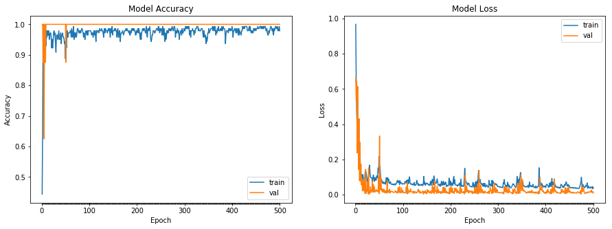

# 鸢尾花的分类


```python
## 导包
import pandas as pd
import numpy as np
import matplotlib.pyplot as plt
import tensorflow as tf

from keras.utils import np_utils
from sklearn.preprocessing import LabelEncoder
from sklearn.model_selection import train_test_split
```

    Using TensorFlow backend.


```python
## 超参数
epochs=500
validation_split=0.05
test_size=0.25
dense1_neurons =512 #第一层神经元的数量
dense2_neurons =256 #第二层神经元的数量
dense3_neurons =128 #第三层神经元的数量
```

## 1.提出问题

根据整理好的鸢尾花数据集，能够进行三种鸢尾花的分类。

## 2.数据的收集和整理

### 2.1 导入数据集


```python
datasets_path = 'data/iris.data'
iris = pd.read_csv(datasets_path,header=None)
print(iris.sample(5))
```

           0    1    2    3                4
    33   5.5  4.2  1.4  0.2      Iris-setosa
    85   6.0  3.4  4.5  1.6  Iris-versicolor
    135  7.7  3.0  6.1  2.3   Iris-virginica
    64   5.6  2.9  3.6  1.3  Iris-versicolor
    0    5.1  3.5  1.4  0.2      Iris-setosa


### 2.2 分割特征和标签


```python
def print_ndarray_random_rows(array_name,rows=5):
    '''
    功能：输出numpy ndarray 的随机几行
    参数：array_name 数组名称
         rows 可选参数，不带入值时默认为5
    '''
    if array_name.ndim >1 :
        print(array_name[np.random.choice(array_name.shape[0], rows, replace=False), :])
    else:
        print(array_name[np.random.choice(array_name.shape[0], rows, replace=False)])
    return
```


```python
# 转换为np.array
iris = np.array(iris)
print("\n=====数据集抽样显示=====")
print_ndarray_random_rows(iris)

# 提取特征
X= iris[:,0:4]
print("\n=====特征抽样显示=====")
print_ndarray_random_rows(X)

# 提取标签
Y = iris[:,4]
print("\n=====标签抽样显示=====")
print_ndarray_random_rows(Y)
```

    
    =====数据集抽样显示=====
    [[7.2 3.2 6.0 1.8 'Iris-virginica']
     [4.7 3.2 1.6 0.2 'Iris-setosa']
     [5.9 3.0 4.2 1.5 'Iris-versicolor']
     [5.0 3.4 1.5 0.2 'Iris-setosa']
     [4.6 3.4 1.4 0.3 'Iris-setosa']]
    
    =====特征抽样显示=====
    [[5.0 3.4 1.5 0.2]
     [5.7 4.4 1.5 0.4]
     [5.7 2.8 4.5 1.3]
     [7.2 3.0 5.8 1.6]
     [4.9 2.5 4.5 1.7]]
    
    =====标签抽样显示=====
    ['Iris-virginica' 'Iris-virginica' 'Iris-virginica' 'Iris-versicolor'
     'Iris-setosa']


### 2.3 将标签转化为one-hot编码


```python
# 将文本型类别转为为数字型类别
encoder = LabelEncoder()
encoder_Y = encoder.fit_transform(Y)
print("\n=====标签数值化的结果=====")
print_ndarray_random_rows(encoder_Y)

# 转化为 one-hot 编码
dummy_y = np_utils.to_categorical(encoder_Y)
print("\n=====标签的one-hot编码=====")
print_ndarray_random_rows(dummy_y)
```

    
    =====标签数值化的结果=====
    [0 2 1 1 1]
    
    =====标签的one-hot编码=====
    [[0. 0. 1.]
     [0. 1. 0.]
     [1. 0. 0.]
     [0. 1. 0.]
     [0. 0. 1.]]


## 2.4 分割训练集和测试集


```python
# 拆分训练集和测试集
X_train,X_test,y_train,y_test = train_test_split(X,dummy_y,test_size=test_size)
print("训练特征集的形状：" + str(X_train.shape))
print("训练标签集的形状：" + str(y_train.shape))
print("测试特征集的形状：" + str(X_test.shape))
print("测试标签集的形状：" + str(y_test.shape))
```

    训练特征集的形状：(112, 4)
    训练标签集的形状：(112, 3)
    测试特征集的形状：(38, 4)
    测试标签集的形状：(38, 3)


## 3.搭建模型

### 3.1 搭建模型


```python
model = tf.keras.Sequential()
model.add(tf.keras.layers.Dense(units=dense1_neurons,input_dim=4,activation='relu'))
model.add(tf.keras.layers.Dense(units=dense2_neurons,activation='relu'))
model.add(tf.keras.layers.Dense(units=dense3_neurons,activation='relu'))
#model.add(tf.keras.layers.Dropout(dropout_rate))
model.add(tf.keras.layers.Dense(units=3,activation="softmax"))
model.summary()  # 查看模型结构
```

    _________________________________________________________________
    Layer (type)                 Output Shape              Param #   
    =================================================================
    dense (Dense)                (None, 512)               2560      
    _________________________________________________________________
    dense_1 (Dense)              (None, 256)               131328    
    _________________________________________________________________
    dense_2 (Dense)              (None, 128)               32896     
    _________________________________________________________________
    dense_3 (Dense)              (None, 3)                 387       
    =================================================================
    Total params: 167,171
    Trainable params: 167,171
    Non-trainable params: 0
    _________________________________________________________________


###  3.2 编译模型


```python
model.compile(loss='categorical_crossentropy', optimizer='adam',metrics=['accuracy'])
```

### 3.3 训练模型


```python
history = model.fit(X,dummy_y,validation_split=validation_split,epochs=epochs)
```

    Train on 142 samples, validate on 8 samples
    Epoch 1/500
    142/142 [==============================] - 1s 5ms/step - loss: 0.9674 - acc: 0.4437 - val_loss: 0.6660 - val_acc: 1.0000
    Epoch 2/500
    142/142 [==============================] - 0s 399us/step - loss: 0.6491 - acc: 0.6549 - val_loss: 0.5337 - val_acc: 1.0000
    Epoch 3/500
    142/142 [==============================] - 0s 188us/step - loss: 0.4673 - acc: 0.9648 - val_loss: 0.6438 - val_acc: 0.8750
    Epoch 4/500
    142/142 [==============================] - 0s 257us/step - loss: 0.3740 - acc: 0.8803 - val_loss: 0.2368 - val_acc: 1.0000
    Epoch 5/500
    142/142 [==============================] - 0s 198us/step - loss: 0.2972 - acc: 0.9366 - val_loss: 0.6141 - val_acc: 0.6250
    Epoch 6/500
    142/142 [==============================] - 0s 301us/step - loss: 0.2772 - acc: 0.9014 - val_loss: 0.3453 - val_acc: 1.0000
    Epoch 7/500
    142/142 [==============================] - 0s 329us/step - loss: 0.2424 - acc: 0.8944 - val_loss: 0.1428 - val_acc: 1.0000
    Epoch 8/500
    142/142 [==============================] - 0s 249us/step - loss: 0.1742 - acc: 0.9718 - val_loss: 0.4309 - val_acc: 0.8750
    Epoch 9/500
    142/142 [==============================] - 0s 350us/step - loss: 0.1854 - acc: 0.9296 - val_loss: 0.0789 - val_acc: 1.0000
    Epoch 10/500
    142/142 [==============================] - 0s 315us/step - loss: 0.1274 - acc: 0.9789 - val_loss: 0.2977 - val_acc: 1.0000
    Epoch 11/500
    142/142 [==============================] - 0s 260us/step - loss: 0.1363 - acc: 0.9577 - val_loss: 0.0761 - val_acc: 1.0000
    Epoch 12/500
    142/142 [==============================] - 0s 258us/step - loss: 0.1111 - acc: 0.9789 - val_loss: 0.1736 - val_acc: 1.0000
    Epoch 13/500
    142/142 [==============================] - 0s 250us/step - loss: 0.1171 - acc: 0.9648 - val_loss: 0.0552 - val_acc: 1.0000
    Epoch 14/500
    142/142 [==============================] - 0s 291us/step - loss: 0.0997 - acc: 0.9648 - val_loss: 0.0891 - val_acc: 1.0000
    Epoch 15/500
    142/142 [==============================] - 0s 282us/step - loss: 0.0891 - acc: 0.9789 - val_loss: 0.0208 - val_acc: 1.0000
    Epoch 16/500
    142/142 [==============================] - 0s 288us/step - loss: 0.1145 - acc: 0.9507 - val_loss: 0.0819 - val_acc: 1.0000
    Epoch 17/500
    142/142 [==============================] - 0s 268us/step - loss: 0.0880 - acc: 0.9648 - val_loss: 0.0494 - val_acc: 1.0000
    Epoch 18/500
    142/142 [==============================] - 0s 202us/step - loss: 0.0833 - acc: 0.9718 - val_loss: 0.0209 - val_acc: 1.0000
    Epoch 19/500
    142/142 [==============================] - 0s 212us/step - loss: 0.0862 - acc: 0.9718 - val_loss: 0.0940 - val_acc: 1.0000
    Epoch 20/500
    142/142 [==============================] - 0s 219us/step - loss: 0.0946 - acc: 0.9577 - val_loss: 0.0090 - val_acc: 1.0000
    Epoch 21/500
    142/142 [==============================] - 0s 226us/step - loss: 0.1342 - acc: 0.9225 - val_loss: 0.0067 - val_acc: 1.0000
    Epoch 22/500
    142/142 [==============================] - 0s 238us/step - loss: 0.1248 - acc: 0.9507 - val_loss: 0.1444 - val_acc: 1.0000
    Epoch 23/500
    142/142 [==============================] - 0s 244us/step - loss: 0.1261 - acc: 0.9225 - val_loss: 0.0072 - val_acc: 1.0000
    Epoch 24/500
    142/142 [==============================] - 0s 219us/step - loss: 0.1040 - acc: 0.9437 - val_loss: 0.0261 - val_acc: 1.0000
    Epoch 25/500
    142/142 [==============================] - 0s 307us/step - loss: 0.0762 - acc: 0.9718 - val_loss: 0.0201 - val_acc: 1.0000
    Epoch 26/500
    142/142 [==============================] - 0s 242us/step - loss: 0.0775 - acc: 0.9789 - val_loss: 0.0724 - val_acc: 1.0000
    Epoch 27/500
    142/142 [==============================] - 0s 232us/step - loss: 0.0890 - acc: 0.9648 - val_loss: 0.0055 - val_acc: 1.0000
    Epoch 28/500
    142/142 [==============================] - 0s 259us/step - loss: 0.1062 - acc: 0.9718 - val_loss: 0.1520 - val_acc: 1.0000
    Epoch 29/500
    142/142 [==============================] - 0s 261us/step - loss: 0.1440 - acc: 0.9366 - val_loss: 0.0023 - val_acc: 1.0000
    Epoch 30/500
    142/142 [==============================] - 0s 349us/step - loss: 0.1679 - acc: 0.9085 - val_loss: 0.0195 - val_acc: 1.0000
    Epoch 31/500
    142/142 [==============================] - 0s 243us/step - loss: 0.1209 - acc: 0.9648 - val_loss: 0.0093 - val_acc: 1.0000
    Epoch 32/500
    142/142 [==============================] - 0s 250us/step - loss: 0.0968 - acc: 0.9648 - val_loss: 0.0444 - val_acc: 1.0000
    Epoch 33/500
    142/142 [==============================] - 0s 258us/step - loss: 0.0968 - acc: 0.9648 - val_loss: 0.0126 - val_acc: 1.0000
    Epoch 34/500
    142/142 [==============================] - 0s 232us/step - loss: 0.0952 - acc: 0.9507 - val_loss: 0.0262 - val_acc: 1.0000
    Epoch 35/500
    142/142 [==============================] - 0s 259us/step - loss: 0.0951 - acc: 0.9648 - val_loss: 0.0192 - val_acc: 1.0000
    Epoch 36/500
    142/142 [==============================] - 0s 233us/step - loss: 0.0643 - acc: 0.9789 - val_loss: 0.0772 - val_acc: 1.0000
    Epoch 37/500
    142/142 [==============================] - 0s 243us/step - loss: 0.0934 - acc: 0.9507 - val_loss: 0.0123 - val_acc: 1.0000
    Epoch 38/500
    142/142 [==============================] - 0s 247us/step - loss: 0.1119 - acc: 0.9507 - val_loss: 0.0575 - val_acc: 1.0000
    Epoch 39/500
    142/142 [==============================] - 0s 229us/step - loss: 0.0970 - acc: 0.9507 - val_loss: 0.0169 - val_acc: 1.0000
    Epoch 40/500
    142/142 [==============================] - 0s 211us/step - loss: 0.0755 - acc: 0.9718 - val_loss: 0.0436 - val_acc: 1.0000
    Epoch 41/500
    142/142 [==============================] - 0s 229us/step - loss: 0.0917 - acc: 0.9366 - val_loss: 0.0147 - val_acc: 1.0000
    Epoch 42/500
    142/142 [==============================] - 0s 245us/step - loss: 0.0968 - acc: 0.9648 - val_loss: 0.0148 - val_acc: 1.0000
    Epoch 43/500
    142/142 [==============================] - 0s 219us/step - loss: 0.0806 - acc: 0.9648 - val_loss: 0.0242 - val_acc: 1.0000
    Epoch 44/500
    142/142 [==============================] - 0s 227us/step - loss: 0.0823 - acc: 0.9718 - val_loss: 0.0291 - val_acc: 1.0000
    Epoch 45/500
    142/142 [==============================] - 0s 199us/step - loss: 0.1068 - acc: 0.9577 - val_loss: 0.0185 - val_acc: 1.0000
    Epoch 46/500
    142/142 [==============================] - 0s 242us/step - loss: 0.0956 - acc: 0.9577 - val_loss: 0.0229 - val_acc: 1.0000
    Epoch 47/500
    142/142 [==============================] - 0s 231us/step - loss: 0.1027 - acc: 0.9507 - val_loss: 0.0214 - val_acc: 1.0000
    Epoch 48/500
    142/142 [==============================] - 0s 246us/step - loss: 0.1514 - acc: 0.9366 - val_loss: 0.0154 - val_acc: 1.0000
    Epoch 49/500
    142/142 [==============================] - 0s 227us/step - loss: 0.1267 - acc: 0.9437 - val_loss: 0.1017 - val_acc: 1.0000
    Epoch 50/500
    142/142 [==============================] - 0s 211us/step - loss: 0.2165 - acc: 0.8873 - val_loss: 0.0061 - val_acc: 1.0000
    Epoch 51/500
    142/142 [==============================] - 0s 217us/step - loss: 0.1254 - acc: 0.9507 - val_loss: 0.3331 - val_acc: 0.8750
    Epoch 52/500
    142/142 [==============================] - 0s 216us/step - loss: 0.1612 - acc: 0.9225 - val_loss: 0.0326 - val_acc: 1.0000
    Epoch 53/500
    142/142 [==============================] - 0s 199us/step - loss: 0.1121 - acc: 0.9648 - val_loss: 0.0267 - val_acc: 1.0000
    Epoch 54/500
    142/142 [==============================] - 0s 235us/step - loss: 0.0749 - acc: 0.9789 - val_loss: 0.0944 - val_acc: 1.0000
    Epoch 55/500
    142/142 [==============================] - 0s 225us/step - loss: 0.0863 - acc: 0.9577 - val_loss: 0.0273 - val_acc: 1.0000
    Epoch 56/500
    142/142 [==============================] - 0s 208us/step - loss: 0.0802 - acc: 0.9718 - val_loss: 0.0195 - val_acc: 1.0000
    Epoch 57/500
    142/142 [==============================] - 0s 175us/step - loss: 0.0681 - acc: 0.9718 - val_loss: 0.0321 - val_acc: 1.0000
    Epoch 58/500
    142/142 [==============================] - 0s 182us/step - loss: 0.0642 - acc: 0.9718 - val_loss: 0.0137 - val_acc: 1.0000
    Epoch 59/500
    142/142 [==============================] - 0s 191us/step - loss: 0.0719 - acc: 0.9718 - val_loss: 0.0161 - val_acc: 1.0000
    Epoch 60/500
    142/142 [==============================] - 0s 230us/step - loss: 0.0621 - acc: 0.9789 - val_loss: 0.0312 - val_acc: 1.0000
    Epoch 61/500
    142/142 [==============================] - 0s 232us/step - loss: 0.0669 - acc: 0.9789 - val_loss: 0.0122 - val_acc: 1.0000
    Epoch 62/500
    142/142 [==============================] - 0s 199us/step - loss: 0.0701 - acc: 0.9577 - val_loss: 0.0225 - val_acc: 1.0000
    Epoch 63/500
    142/142 [==============================] - 0s 191us/step - loss: 0.0593 - acc: 0.9859 - val_loss: 0.0104 - val_acc: 1.0000
    Epoch 64/500
    142/142 [==============================] - 0s 209us/step - loss: 0.0689 - acc: 0.9789 - val_loss: 0.0231 - val_acc: 1.0000
    Epoch 65/500
    142/142 [==============================] - 0s 218us/step - loss: 0.0960 - acc: 0.9577 - val_loss: 0.0138 - val_acc: 1.0000
    Epoch 66/500
    142/142 [==============================] - 0s 221us/step - loss: 0.0867 - acc: 0.9648 - val_loss: 0.0085 - val_acc: 1.0000
    Epoch 67/500
    142/142 [==============================] - 0s 217us/step - loss: 0.0510 - acc: 0.9930 - val_loss: 0.0791 - val_acc: 1.0000
    Epoch 68/500
    142/142 [==============================] - 0s 221us/step - loss: 0.0974 - acc: 0.9507 - val_loss: 0.0124 - val_acc: 1.0000
    Epoch 69/500
    142/142 [==============================] - 0s 205us/step - loss: 0.0750 - acc: 0.9718 - val_loss: 0.0219 - val_acc: 1.0000
    Epoch 70/500
    142/142 [==============================] - 0s 203us/step - loss: 0.0889 - acc: 0.9577 - val_loss: 0.0230 - val_acc: 1.0000
    Epoch 71/500
    142/142 [==============================] - 0s 211us/step - loss: 0.0703 - acc: 0.9718 - val_loss: 0.0106 - val_acc: 1.0000
    Epoch 72/500
    142/142 [==============================] - 0s 212us/step - loss: 0.0624 - acc: 0.9718 - val_loss: 0.0310 - val_acc: 1.0000
    Epoch 73/500
    142/142 [==============================] - 0s 261us/step - loss: 0.0697 - acc: 0.9577 - val_loss: 0.0093 - val_acc: 1.0000
    Epoch 74/500
    142/142 [==============================] - 0s 237us/step - loss: 0.0735 - acc: 0.9718 - val_loss: 0.0187 - val_acc: 1.0000
    Epoch 75/500
    142/142 [==============================] - 0s 224us/step - loss: 0.0618 - acc: 0.9859 - val_loss: 0.0199 - val_acc: 1.0000
    Epoch 76/500
    142/142 [==============================] - 0s 233us/step - loss: 0.0583 - acc: 0.9859 - val_loss: 0.0165 - val_acc: 1.0000
    Epoch 77/500
    142/142 [==============================] - 0s 230us/step - loss: 0.0584 - acc: 0.9789 - val_loss: 0.0174 - val_acc: 1.0000
    Epoch 78/500
    142/142 [==============================] - 0s 228us/step - loss: 0.0578 - acc: 0.9718 - val_loss: 0.0171 - val_acc: 1.0000
    Epoch 79/500
    142/142 [==============================] - 0s 222us/step - loss: 0.0612 - acc: 0.9789 - val_loss: 0.0139 - val_acc: 1.0000
    Epoch 80/500
    142/142 [==============================] - 0s 233us/step - loss: 0.0559 - acc: 0.9718 - val_loss: 0.0148 - val_acc: 1.0000
    Epoch 81/500
    142/142 [==============================] - 0s 231us/step - loss: 0.0557 - acc: 0.9789 - val_loss: 0.0122 - val_acc: 1.0000
    Epoch 82/500
    142/142 [==============================] - 0s 225us/step - loss: 0.0594 - acc: 0.9718 - val_loss: 0.0125 - val_acc: 1.0000
    Epoch 83/500
    142/142 [==============================] - 0s 221us/step - loss: 0.0615 - acc: 0.9789 - val_loss: 0.0142 - val_acc: 1.0000
    Epoch 84/500
    142/142 [==============================] - 0s 244us/step - loss: 0.0544 - acc: 0.9859 - val_loss: 0.0222 - val_acc: 1.0000
    Epoch 85/500
    142/142 [==============================] - 0s 265us/step - loss: 0.0582 - acc: 0.9859 - val_loss: 0.0143 - val_acc: 1.0000
    Epoch 86/500
    142/142 [==============================] - 0s 262us/step - loss: 0.0650 - acc: 0.9789 - val_loss: 0.0179 - val_acc: 1.0000
    Epoch 87/500
    142/142 [==============================] - 0s 239us/step - loss: 0.0654 - acc: 0.9718 - val_loss: 0.0151 - val_acc: 1.0000
    Epoch 88/500
    142/142 [==============================] - 0s 236us/step - loss: 0.0793 - acc: 0.9577 - val_loss: 0.0078 - val_acc: 1.0000
    Epoch 89/500
    142/142 [==============================] - 0s 196us/step - loss: 0.0806 - acc: 0.9718 - val_loss: 0.0148 - val_acc: 1.0000
    Epoch 90/500
    142/142 [==============================] - 0s 249us/step - loss: 0.0685 - acc: 0.9648 - val_loss: 0.0400 - val_acc: 1.0000
    Epoch 91/500
    142/142 [==============================] - 0s 209us/step - loss: 0.0738 - acc: 0.9507 - val_loss: 0.0112 - val_acc: 1.0000
    Epoch 92/500
    142/142 [==============================] - 0s 244us/step - loss: 0.0780 - acc: 0.9718 - val_loss: 0.0127 - val_acc: 1.0000
    Epoch 93/500
    142/142 [==============================] - 0s 206us/step - loss: 0.0570 - acc: 0.9789 - val_loss: 0.0467 - val_acc: 1.0000
    Epoch 94/500
    142/142 [==============================] - 0s 248us/step - loss: 0.0790 - acc: 0.9718 - val_loss: 0.0119 - val_acc: 1.0000
    Epoch 95/500
    142/142 [==============================] - 0s 260us/step - loss: 0.0660 - acc: 0.9648 - val_loss: 0.0174 - val_acc: 1.0000
    Epoch 96/500
    142/142 [==============================] - 0s 294us/step - loss: 0.0649 - acc: 0.9789 - val_loss: 0.0104 - val_acc: 1.0000
    Epoch 97/500
    142/142 [==============================] - 0s 202us/step - loss: 0.0676 - acc: 0.9648 - val_loss: 0.0386 - val_acc: 1.0000
    Epoch 98/500
    142/142 [==============================] - 0s 247us/step - loss: 0.0631 - acc: 0.9789 - val_loss: 0.0115 - val_acc: 1.0000
    Epoch 99/500
    142/142 [==============================] - 0s 247us/step - loss: 0.0589 - acc: 0.9789 - val_loss: 0.0205 - val_acc: 1.0000
    Epoch 100/500
    142/142 [==============================] - 0s 202us/step - loss: 0.0619 - acc: 0.9789 - val_loss: 0.0244 - val_acc: 1.0000
    Epoch 101/500
    142/142 [==============================] - 0s 241us/step - loss: 0.0615 - acc: 0.9789 - val_loss: 0.0107 - val_acc: 1.0000
    Epoch 102/500
    142/142 [==============================] - 0s 199us/step - loss: 0.0614 - acc: 0.9789 - val_loss: 0.0141 - val_acc: 1.0000
    Epoch 103/500
    142/142 [==============================] - 0s 390us/step - loss: 0.0596 - acc: 0.9789 - val_loss: 0.0092 - val_acc: 1.0000
    Epoch 104/500
    142/142 [==============================] - 0s 277us/step - loss: 0.0712 - acc: 0.9718 - val_loss: 0.0121 - val_acc: 1.0000
    Epoch 105/500
    142/142 [==============================] - 0s 215us/step - loss: 0.0748 - acc: 0.9648 - val_loss: 0.0118 - val_acc: 1.0000
    Epoch 106/500
    142/142 [==============================] - 0s 247us/step - loss: 0.0739 - acc: 0.9718 - val_loss: 0.0120 - val_acc: 1.0000
    Epoch 107/500
    142/142 [==============================] - 0s 244us/step - loss: 0.0654 - acc: 0.9718 - val_loss: 0.0424 - val_acc: 1.0000
    Epoch 108/500
    142/142 [==============================] - 0s 245us/step - loss: 0.0822 - acc: 0.9577 - val_loss: 0.0077 - val_acc: 1.0000
    Epoch 109/500
    142/142 [==============================] - 0s 228us/step - loss: 0.0729 - acc: 0.9718 - val_loss: 0.0704 - val_acc: 1.0000
    Epoch 110/500
    142/142 [==============================] - 0s 215us/step - loss: 0.0760 - acc: 0.9789 - val_loss: 0.0043 - val_acc: 1.0000
    Epoch 111/500
    142/142 [==============================] - 0s 203us/step - loss: 0.0850 - acc: 0.9648 - val_loss: 0.0302 - val_acc: 1.0000
    Epoch 112/500
    142/142 [==============================] - 0s 239us/step - loss: 0.0620 - acc: 0.9789 - val_loss: 0.0185 - val_acc: 1.0000
    Epoch 113/500
    142/142 [==============================] - 0s 215us/step - loss: 0.0882 - acc: 0.9648 - val_loss: 0.0122 - val_acc: 1.0000
    Epoch 114/500
    142/142 [==============================] - 0s 230us/step - loss: 0.1011 - acc: 0.9437 - val_loss: 0.0194 - val_acc: 1.0000
    Epoch 115/500
    142/142 [==============================] - 0s 256us/step - loss: 0.0698 - acc: 0.9789 - val_loss: 0.0140 - val_acc: 1.0000
    Epoch 116/500
    142/142 [==============================] - 0s 240us/step - loss: 0.0610 - acc: 0.9718 - val_loss: 0.0329 - val_acc: 1.0000
    Epoch 117/500
    142/142 [==============================] - 0s 221us/step - loss: 0.0616 - acc: 0.9789 - val_loss: 0.0200 - val_acc: 1.0000
    Epoch 118/500
    142/142 [==============================] - 0s 221us/step - loss: 0.0577 - acc: 0.9789 - val_loss: 0.0180 - val_acc: 1.0000
    Epoch 119/500
    142/142 [==============================] - 0s 208us/step - loss: 0.0608 - acc: 0.9789 - val_loss: 0.0179 - val_acc: 1.0000
    Epoch 120/500
    142/142 [==============================] - 0s 208us/step - loss: 0.0589 - acc: 0.9718 - val_loss: 0.0110 - val_acc: 1.0000
    Epoch 121/500
    142/142 [==============================] - 0s 213us/step - loss: 0.0604 - acc: 0.9789 - val_loss: 0.0132 - val_acc: 1.0000
    Epoch 122/500
    142/142 [==============================] - 0s 243us/step - loss: 0.0539 - acc: 0.9859 - val_loss: 0.0192 - val_acc: 1.0000
    Epoch 123/500
    142/142 [==============================] - 0s 236us/step - loss: 0.0629 - acc: 0.9789 - val_loss: 0.0067 - val_acc: 1.0000
    Epoch 124/500
    142/142 [==============================] - 0s 228us/step - loss: 0.0693 - acc: 0.9789 - val_loss: 0.0142 - val_acc: 1.0000
    Epoch 125/500
    142/142 [==============================] - 0s 239us/step - loss: 0.0521 - acc: 0.9789 - val_loss: 0.0188 - val_acc: 1.0000
    Epoch 126/500
    142/142 [==============================] - 0s 211us/step - loss: 0.0560 - acc: 0.9859 - val_loss: 0.0121 - val_acc: 1.0000
    Epoch 127/500
    142/142 [==============================] - 0s 242us/step - loss: 0.0534 - acc: 0.9789 - val_loss: 0.0140 - val_acc: 1.0000
    Epoch 128/500
    142/142 [==============================] - 0s 212us/step - loss: 0.0595 - acc: 0.9789 - val_loss: 0.0084 - val_acc: 1.0000
    Epoch 129/500
    142/142 [==============================] - 0s 219us/step - loss: 0.0813 - acc: 0.9718 - val_loss: 0.0136 - val_acc: 1.0000
    Epoch 130/500
    142/142 [==============================] - 0s 235us/step - loss: 0.0698 - acc: 0.9577 - val_loss: 0.0139 - val_acc: 1.0000
    Epoch 131/500
    142/142 [==============================] - 0s 216us/step - loss: 0.0632 - acc: 0.9789 - val_loss: 0.0133 - val_acc: 1.0000
    Epoch 132/500
    142/142 [==============================] - 0s 242us/step - loss: 0.0534 - acc: 0.9859 - val_loss: 0.0307 - val_acc: 1.0000
    Epoch 133/500
    142/142 [==============================] - 0s 215us/step - loss: 0.0624 - acc: 0.9718 - val_loss: 0.0182 - val_acc: 1.0000
    Epoch 134/500
    142/142 [==============================] - 0s 230us/step - loss: 0.0518 - acc: 0.9859 - val_loss: 0.0234 - val_acc: 1.0000
    Epoch 135/500
    142/142 [==============================] - 0s 236us/step - loss: 0.0563 - acc: 0.9789 - val_loss: 0.0095 - val_acc: 1.0000
    Epoch 136/500
    142/142 [==============================] - 0s 260us/step - loss: 0.0539 - acc: 0.9789 - val_loss: 0.0199 - val_acc: 1.0000
    Epoch 137/500
    142/142 [==============================] - 0s 209us/step - loss: 0.0564 - acc: 0.9789 - val_loss: 0.0084 - val_acc: 1.0000
    Epoch 138/500
    142/142 [==============================] - 0s 238us/step - loss: 0.0539 - acc: 0.9718 - val_loss: 0.0108 - val_acc: 1.0000
    Epoch 139/500
    142/142 [==============================] - 0s 182us/step - loss: 0.0534 - acc: 0.9789 - val_loss: 0.0123 - val_acc: 1.0000
    Epoch 140/500
    142/142 [==============================] - 0s 223us/step - loss: 0.0597 - acc: 0.9859 - val_loss: 0.0122 - val_acc: 1.0000
    Epoch 141/500
    142/142 [==============================] - 0s 240us/step - loss: 0.0521 - acc: 0.9789 - val_loss: 0.0156 - val_acc: 1.0000
    Epoch 142/500
    142/142 [==============================] - 0s 212us/step - loss: 0.0511 - acc: 0.9859 - val_loss: 0.0214 - val_acc: 1.0000
    Epoch 143/500
    142/142 [==============================] - 0s 197us/step - loss: 0.0633 - acc: 0.9789 - val_loss: 0.0031 - val_acc: 1.0000
    Epoch 144/500
    142/142 [==============================] - 0s 277us/step - loss: 0.1037 - acc: 0.9577 - val_loss: 0.0167 - val_acc: 1.0000
    Epoch 145/500
    142/142 [==============================] - 0s 261us/step - loss: 0.0596 - acc: 0.9859 - val_loss: 0.0167 - val_acc: 1.0000
    Epoch 146/500
    142/142 [==============================] - 0s 237us/step - loss: 0.0702 - acc: 0.9718 - val_loss: 0.0093 - val_acc: 1.0000
    Epoch 147/500
    142/142 [==============================] - 0s 212us/step - loss: 0.0534 - acc: 0.9789 - val_loss: 0.0233 - val_acc: 1.0000
    Epoch 148/500
    142/142 [==============================] - 0s 254us/step - loss: 0.0572 - acc: 0.9930 - val_loss: 0.0085 - val_acc: 1.0000
    Epoch 149/500
    142/142 [==============================] - 0s 240us/step - loss: 0.0657 - acc: 0.9648 - val_loss: 0.0110 - val_acc: 1.0000
    Epoch 150/500
    142/142 [==============================] - 0s 187us/step - loss: 0.0630 - acc: 0.9789 - val_loss: 0.0049 - val_acc: 1.0000
    Epoch 151/500
    142/142 [==============================] - 0s 224us/step - loss: 0.0649 - acc: 0.9789 - val_loss: 0.0287 - val_acc: 1.0000
    Epoch 152/500
    142/142 [==============================] - 0s 254us/step - loss: 0.0631 - acc: 0.9789 - val_loss: 0.0123 - val_acc: 1.0000
    Epoch 153/500
    142/142 [==============================] - 0s 238us/step - loss: 0.0568 - acc: 0.9859 - val_loss: 0.0242 - val_acc: 1.0000
    Epoch 154/500
    142/142 [==============================] - 0s 183us/step - loss: 0.0587 - acc: 0.9789 - val_loss: 0.0151 - val_acc: 1.0000
    Epoch 155/500
    142/142 [==============================] - 0s 243us/step - loss: 0.0532 - acc: 0.9859 - val_loss: 0.0197 - val_acc: 1.0000
    Epoch 156/500
    142/142 [==============================] - 0s 210us/step - loss: 0.0529 - acc: 0.9789 - val_loss: 0.0104 - val_acc: 1.0000
    Epoch 157/500
    142/142 [==============================] - 0s 255us/step - loss: 0.0591 - acc: 0.9789 - val_loss: 0.0126 - val_acc: 1.0000
    Epoch 158/500
    142/142 [==============================] - 0s 255us/step - loss: 0.0761 - acc: 0.9577 - val_loss: 0.0092 - val_acc: 1.0000
    Epoch 159/500
    142/142 [==============================] - 0s 216us/step - loss: 0.0536 - acc: 0.9789 - val_loss: 0.0220 - val_acc: 1.0000
    Epoch 160/500
    142/142 [==============================] - 0s 252us/step - loss: 0.0603 - acc: 0.9859 - val_loss: 0.0075 - val_acc: 1.0000
    Epoch 161/500
    142/142 [==============================] - 0s 201us/step - loss: 0.0781 - acc: 0.9577 - val_loss: 0.0111 - val_acc: 1.0000
    Epoch 162/500
    142/142 [==============================] - 0s 218us/step - loss: 0.0871 - acc: 0.9577 - val_loss: 0.0627 - val_acc: 1.0000
    Epoch 163/500
    142/142 [==============================] - 0s 262us/step - loss: 0.0663 - acc: 0.9789 - val_loss: 0.0120 - val_acc: 1.0000
    Epoch 164/500
    142/142 [==============================] - 0s 211us/step - loss: 0.0562 - acc: 0.9789 - val_loss: 0.0423 - val_acc: 1.0000
    Epoch 165/500
    142/142 [==============================] - 0s 207us/step - loss: 0.1062 - acc: 0.9437 - val_loss: 0.0187 - val_acc: 1.0000
    Epoch 166/500
    142/142 [==============================] - 0s 265us/step - loss: 0.0921 - acc: 0.9648 - val_loss: 0.0055 - val_acc: 1.0000
    Epoch 167/500
    142/142 [==============================] - 0s 230us/step - loss: 0.0807 - acc: 0.9718 - val_loss: 0.0783 - val_acc: 1.0000
    Epoch 168/500
    142/142 [==============================] - 0s 202us/step - loss: 0.0695 - acc: 0.9718 - val_loss: 0.0164 - val_acc: 1.0000
    Epoch 169/500
    142/142 [==============================] - 0s 220us/step - loss: 0.0643 - acc: 0.9718 - val_loss: 0.0188 - val_acc: 1.0000
    Epoch 170/500
    142/142 [==============================] - 0s 215us/step - loss: 0.0644 - acc: 0.9789 - val_loss: 0.0220 - val_acc: 1.0000
    Epoch 171/500
    142/142 [==============================] - 0s 201us/step - loss: 0.0749 - acc: 0.9718 - val_loss: 0.0065 - val_acc: 1.0000
    Epoch 172/500
    142/142 [==============================] - 0s 247us/step - loss: 0.0894 - acc: 0.9648 - val_loss: 0.0490 - val_acc: 1.0000
    Epoch 173/500
    142/142 [==============================] - 0s 260us/step - loss: 0.0747 - acc: 0.9718 - val_loss: 0.0116 - val_acc: 1.0000
    Epoch 174/500
    142/142 [==============================] - 0s 207us/step - loss: 0.0578 - acc: 0.9789 - val_loss: 0.0291 - val_acc: 1.0000
    Epoch 175/500
    142/142 [==============================] - 0s 245us/step - loss: 0.0534 - acc: 0.9789 - val_loss: 0.0106 - val_acc: 1.0000
    Epoch 176/500
    142/142 [==============================] - 0s 213us/step - loss: 0.0572 - acc: 0.9789 - val_loss: 0.0196 - val_acc: 1.0000
    Epoch 177/500
    142/142 [==============================] - 0s 242us/step - loss: 0.0503 - acc: 0.9859 - val_loss: 0.0108 - val_acc: 1.0000
    Epoch 178/500
    142/142 [==============================] - 0s 223us/step - loss: 0.0602 - acc: 0.9789 - val_loss: 0.0123 - val_acc: 1.0000
    Epoch 179/500
    142/142 [==============================] - 0s 229us/step - loss: 0.0473 - acc: 0.9859 - val_loss: 0.0184 - val_acc: 1.0000
    Epoch 180/500
    142/142 [==============================] - 0s 212us/step - loss: 0.0523 - acc: 0.9789 - val_loss: 0.0061 - val_acc: 1.0000
    Epoch 181/500
    142/142 [==============================] - 0s 219us/step - loss: 0.0760 - acc: 0.9789 - val_loss: 0.0125 - val_acc: 1.0000
    Epoch 182/500
    142/142 [==============================] - 0s 193us/step - loss: 0.0547 - acc: 0.9789 - val_loss: 0.0176 - val_acc: 1.0000
    Epoch 183/500
    142/142 [==============================] - 0s 244us/step - loss: 0.0671 - acc: 0.9718 - val_loss: 0.0103 - val_acc: 1.0000
    Epoch 184/500
    142/142 [==============================] - 0s 233us/step - loss: 0.0540 - acc: 0.9789 - val_loss: 0.0400 - val_acc: 1.0000
    Epoch 185/500
    142/142 [==============================] - 0s 200us/step - loss: 0.0762 - acc: 0.9648 - val_loss: 0.0106 - val_acc: 1.0000
    Epoch 186/500
    142/142 [==============================] - 0s 242us/step - loss: 0.0589 - acc: 0.9648 - val_loss: 0.0436 - val_acc: 1.0000
    Epoch 187/500
    142/142 [==============================] - 0s 249us/step - loss: 0.0544 - acc: 0.9789 - val_loss: 0.0114 - val_acc: 1.0000
    Epoch 188/500
    142/142 [==============================] - 0s 236us/step - loss: 0.0687 - acc: 0.9718 - val_loss: 0.0167 - val_acc: 1.0000
    Epoch 189/500
    142/142 [==============================] - 0s 228us/step - loss: 0.0593 - acc: 0.9859 - val_loss: 0.0395 - val_acc: 1.0000
    Epoch 190/500
    142/142 [==============================] - 0s 227us/step - loss: 0.0709 - acc: 0.9789 - val_loss: 0.0103 - val_acc: 1.0000
    Epoch 191/500
    142/142 [==============================] - 0s 224us/step - loss: 0.0548 - acc: 0.9859 - val_loss: 0.0222 - val_acc: 1.0000
    Epoch 192/500
    142/142 [==============================] - 0s 223us/step - loss: 0.0453 - acc: 0.9859 - val_loss: 0.0091 - val_acc: 1.0000
    Epoch 193/500
    142/142 [==============================] - 0s 231us/step - loss: 0.0530 - acc: 0.9789 - val_loss: 0.0144 - val_acc: 1.0000
    Epoch 194/500
    142/142 [==============================] - 0s 230us/step - loss: 0.0525 - acc: 0.9859 - val_loss: 0.0091 - val_acc: 1.0000
    Epoch 195/500
    142/142 [==============================] - 0s 229us/step - loss: 0.0485 - acc: 0.9789 - val_loss: 0.0129 - val_acc: 1.0000
    Epoch 196/500
    142/142 [==============================] - 0s 235us/step - loss: 0.0548 - acc: 0.9789 - val_loss: 0.0078 - val_acc: 1.0000
    Epoch 197/500
    142/142 [==============================] - 0s 220us/step - loss: 0.0940 - acc: 0.9648 - val_loss: 0.0044 - val_acc: 1.0000
    Epoch 198/500
    142/142 [==============================] - 0s 234us/step - loss: 0.0833 - acc: 0.9648 - val_loss: 0.0384 - val_acc: 1.0000
    Epoch 199/500
    142/142 [==============================] - 0s 239us/step - loss: 0.0533 - acc: 0.9789 - val_loss: 0.0066 - val_acc: 1.0000
    Epoch 200/500
    142/142 [==============================] - 0s 223us/step - loss: 0.0765 - acc: 0.9718 - val_loss: 0.0224 - val_acc: 1.0000
    Epoch 201/500
    142/142 [==============================] - 0s 197us/step - loss: 0.0591 - acc: 0.9789 - val_loss: 0.0503 - val_acc: 1.0000
    Epoch 202/500
    142/142 [==============================] - 0s 281us/step - loss: 0.0538 - acc: 0.9859 - val_loss: 0.0139 - val_acc: 1.0000
    Epoch 203/500
    142/142 [==============================] - 0s 190us/step - loss: 0.0667 - acc: 0.9718 - val_loss: 0.0123 - val_acc: 1.0000
    Epoch 204/500
    142/142 [==============================] - 0s 238us/step - loss: 0.0523 - acc: 0.9859 - val_loss: 0.0371 - val_acc: 1.0000
    Epoch 205/500
    142/142 [==============================] - 0s 193us/step - loss: 0.0542 - acc: 0.9789 - val_loss: 0.0107 - val_acc: 1.0000
    Epoch 206/500
    142/142 [==============================] - 0s 236us/step - loss: 0.0886 - acc: 0.9648 - val_loss: 0.0101 - val_acc: 1.0000
    Epoch 207/500
    142/142 [==============================] - 0s 275us/step - loss: 0.1039 - acc: 0.9507 - val_loss: 0.0171 - val_acc: 1.0000
    Epoch 208/500
    142/142 [==============================] - 0s 234us/step - loss: 0.0614 - acc: 0.9718 - val_loss: 0.0069 - val_acc: 1.0000
    Epoch 209/500
    142/142 [==============================] - 0s 242us/step - loss: 0.0851 - acc: 0.9507 - val_loss: 0.0369 - val_acc: 1.0000
    Epoch 210/500
    142/142 [==============================] - 0s 224us/step - loss: 0.0562 - acc: 0.9718 - val_loss: 0.0193 - val_acc: 1.0000
    Epoch 211/500
    142/142 [==============================] - 0s 231us/step - loss: 0.0549 - acc: 0.9789 - val_loss: 0.0260 - val_acc: 1.0000
    Epoch 212/500
    142/142 [==============================] - 0s 208us/step - loss: 0.0535 - acc: 0.9859 - val_loss: 0.0359 - val_acc: 1.0000
    Epoch 213/500
    142/142 [==============================] - 0s 236us/step - loss: 0.0521 - acc: 0.9859 - val_loss: 0.0128 - val_acc: 1.0000
    Epoch 214/500
    142/142 [==============================] - 0s 194us/step - loss: 0.0561 - acc: 0.9789 - val_loss: 0.0099 - val_acc: 1.0000
    Epoch 215/500
    142/142 [==============================] - 0s 256us/step - loss: 0.0480 - acc: 0.9859 - val_loss: 0.0265 - val_acc: 1.0000
    Epoch 216/500
    142/142 [==============================] - 0s 200us/step - loss: 0.0528 - acc: 0.9859 - val_loss: 0.0124 - val_acc: 1.0000
    Epoch 217/500
    142/142 [==============================] - 0s 250us/step - loss: 0.0535 - acc: 0.9789 - val_loss: 0.0159 - val_acc: 1.0000
    Epoch 218/500
    142/142 [==============================] - 0s 216us/step - loss: 0.0604 - acc: 0.9718 - val_loss: 0.0098 - val_acc: 1.0000
    Epoch 219/500
    142/142 [==============================] - 0s 231us/step - loss: 0.0654 - acc: 0.9718 - val_loss: 0.0075 - val_acc: 1.0000
    Epoch 220/500
    142/142 [==============================] - 0s 207us/step - loss: 0.0480 - acc: 0.9930 - val_loss: 0.0455 - val_acc: 1.0000
    Epoch 221/500
    142/142 [==============================] - 0s 210us/step - loss: 0.0671 - acc: 0.9648 - val_loss: 0.0060 - val_acc: 1.0000
    Epoch 222/500
    142/142 [==============================] - 0s 268us/step - loss: 0.0889 - acc: 0.9577 - val_loss: 0.0209 - val_acc: 1.0000
    Epoch 223/500
    142/142 [==============================] - 0s 254us/step - loss: 0.0460 - acc: 0.9859 - val_loss: 0.0349 - val_acc: 1.0000
    Epoch 224/500
    142/142 [==============================] - 0s 195us/step - loss: 0.0524 - acc: 0.9859 - val_loss: 0.0121 - val_acc: 1.0000
    Epoch 225/500
    142/142 [==============================] - 0s 185us/step - loss: 0.0516 - acc: 0.9789 - val_loss: 0.0114 - val_acc: 1.0000
    Epoch 226/500
    142/142 [==============================] - 0s 206us/step - loss: 0.0504 - acc: 0.9859 - val_loss: 0.0151 - val_acc: 1.0000
    Epoch 227/500
    142/142 [==============================] - 0s 215us/step - loss: 0.0455 - acc: 0.9930 - val_loss: 0.0115 - val_acc: 1.0000
    Epoch 228/500
    142/142 [==============================] - 0s 230us/step - loss: 0.0515 - acc: 0.9789 - val_loss: 0.0191 - val_acc: 1.0000
    Epoch 229/500
    142/142 [==============================] - 0s 230us/step - loss: 0.0897 - acc: 0.9507 - val_loss: 0.0033 - val_acc: 1.0000
    Epoch 230/500
    142/142 [==============================] - 0s 215us/step - loss: 0.1495 - acc: 0.9437 - val_loss: 0.0107 - val_acc: 1.0000
    Epoch 231/500
    142/142 [==============================] - 0s 203us/step - loss: 0.0923 - acc: 0.9507 - val_loss: 0.1103 - val_acc: 1.0000
    Epoch 232/500
    142/142 [==============================] - 0s 228us/step - loss: 0.0750 - acc: 0.9648 - val_loss: 0.0115 - val_acc: 1.0000
    Epoch 233/500
    142/142 [==============================] - 0s 211us/step - loss: 0.0731 - acc: 0.9648 - val_loss: 0.0258 - val_acc: 1.0000
    Epoch 234/500
    142/142 [==============================] - 0s 247us/step - loss: 0.0654 - acc: 0.9789 - val_loss: 0.0484 - val_acc: 1.0000
    Epoch 235/500
    142/142 [==============================] - 0s 232us/step - loss: 0.0607 - acc: 0.9789 - val_loss: 0.0169 - val_acc: 1.0000
    Epoch 236/500
    142/142 [==============================] - 0s 221us/step - loss: 0.0542 - acc: 0.9789 - val_loss: 0.0254 - val_acc: 1.0000
    Epoch 237/500
    142/142 [==============================] - 0s 270us/step - loss: 0.0661 - acc: 0.9718 - val_loss: 0.0229 - val_acc: 1.0000
    Epoch 238/500
    142/142 [==============================] - 0s 218us/step - loss: 0.0620 - acc: 0.9718 - val_loss: 0.0093 - val_acc: 1.0000
    Epoch 239/500
    142/142 [==============================] - 0s 214us/step - loss: 0.0625 - acc: 0.9789 - val_loss: 0.0227 - val_acc: 1.0000
    Epoch 240/500
    142/142 [==============================] - 0s 214us/step - loss: 0.0499 - acc: 0.9789 - val_loss: 0.0136 - val_acc: 1.0000
    Epoch 241/500
    142/142 [==============================] - 0s 214us/step - loss: 0.0474 - acc: 0.9859 - val_loss: 0.0212 - val_acc: 1.0000
    Epoch 242/500
    142/142 [==============================] - 0s 221us/step - loss: 0.0470 - acc: 0.9859 - val_loss: 0.0174 - val_acc: 1.0000
    Epoch 243/500
    142/142 [==============================] - 0s 226us/step - loss: 0.0455 - acc: 0.9859 - val_loss: 0.0139 - val_acc: 1.0000
    Epoch 244/500
    142/142 [==============================] - 0s 230us/step - loss: 0.0468 - acc: 0.9789 - val_loss: 0.0126 - val_acc: 1.0000
    Epoch 245/500
    142/142 [==============================] - 0s 252us/step - loss: 0.0424 - acc: 0.9930 - val_loss: 0.0222 - val_acc: 1.0000
    Epoch 246/500
    142/142 [==============================] - 0s 226us/step - loss: 0.0455 - acc: 0.9930 - val_loss: 0.0058 - val_acc: 1.0000
    Epoch 247/500
    142/142 [==============================] - 0s 231us/step - loss: 0.0692 - acc: 0.9789 - val_loss: 0.0080 - val_acc: 1.0000
    Epoch 248/500
    142/142 [==============================] - 0s 227us/step - loss: 0.0671 - acc: 0.9718 - val_loss: 0.0170 - val_acc: 1.0000
    Epoch 249/500
    142/142 [==============================] - 0s 231us/step - loss: 0.0419 - acc: 0.9859 - val_loss: 0.0094 - val_acc: 1.0000
    Epoch 250/500
    142/142 [==============================] - 0s 224us/step - loss: 0.0570 - acc: 0.9789 - val_loss: 0.0122 - val_acc: 1.0000
    Epoch 251/500
    142/142 [==============================] - 0s 235us/step - loss: 0.0378 - acc: 0.9859 - val_loss: 0.0429 - val_acc: 1.0000
    Epoch 252/500
    142/142 [==============================] - 0s 229us/step - loss: 0.0662 - acc: 0.9789 - val_loss: 0.0069 - val_acc: 1.0000
    Epoch 253/500
    142/142 [==============================] - 0s 205us/step - loss: 0.0736 - acc: 0.9648 - val_loss: 0.0122 - val_acc: 1.0000
    Epoch 254/500
    142/142 [==============================] - 0s 250us/step - loss: 0.0409 - acc: 0.9930 - val_loss: 0.0352 - val_acc: 1.0000
    Epoch 255/500
    142/142 [==============================] - 0s 221us/step - loss: 0.0642 - acc: 0.9718 - val_loss: 0.0100 - val_acc: 1.0000
    Epoch 256/500
    142/142 [==============================] - 0s 245us/step - loss: 0.0786 - acc: 0.9648 - val_loss: 0.0069 - val_acc: 1.0000
    Epoch 257/500
    142/142 [==============================] - 0s 234us/step - loss: 0.0369 - acc: 0.9859 - val_loss: 0.0597 - val_acc: 1.0000
    Epoch 258/500
    142/142 [==============================] - 0s 213us/step - loss: 0.0994 - acc: 0.9577 - val_loss: 0.0041 - val_acc: 1.0000
    Epoch 259/500
    142/142 [==============================] - 0s 216us/step - loss: 0.1381 - acc: 0.9437 - val_loss: 0.0113 - val_acc: 1.0000
    Epoch 260/500
    142/142 [==============================] - 0s 254us/step - loss: 0.0677 - acc: 0.9718 - val_loss: 0.1367 - val_acc: 1.0000
    Epoch 261/500
    142/142 [==============================] - 0s 246us/step - loss: 0.0762 - acc: 0.9507 - val_loss: 0.0175 - val_acc: 1.0000
    Epoch 262/500
    142/142 [==============================] - 0s 225us/step - loss: 0.0873 - acc: 0.9577 - val_loss: 0.0091 - val_acc: 1.0000
    Epoch 263/500
    142/142 [==============================] - 0s 209us/step - loss: 0.0677 - acc: 0.9789 - val_loss: 0.0347 - val_acc: 1.0000
    Epoch 264/500
    142/142 [==============================] - 0s 219us/step - loss: 0.0637 - acc: 0.9718 - val_loss: 0.0561 - val_acc: 1.0000
    Epoch 265/500
    142/142 [==============================] - 0s 191us/step - loss: 0.0583 - acc: 0.9789 - val_loss: 0.0117 - val_acc: 1.0000
    Epoch 266/500
    142/142 [==============================] - 0s 236us/step - loss: 0.0634 - acc: 0.9718 - val_loss: 0.0144 - val_acc: 1.0000
    Epoch 267/500
    142/142 [==============================] - 0s 246us/step - loss: 0.0582 - acc: 0.9859 - val_loss: 0.0297 - val_acc: 1.0000
    Epoch 268/500
    142/142 [==============================] - 0s 200us/step - loss: 0.0469 - acc: 0.9859 - val_loss: 0.0088 - val_acc: 1.0000
    Epoch 269/500
    142/142 [==============================] - 0s 230us/step - loss: 0.0598 - acc: 0.9789 - val_loss: 0.0184 - val_acc: 1.0000
    Epoch 270/500
    142/142 [==============================] - 0s 226us/step - loss: 0.0647 - acc: 0.9789 - val_loss: 0.0172 - val_acc: 1.0000
    Epoch 271/500
    142/142 [==============================] - 0s 221us/step - loss: 0.0464 - acc: 0.9859 - val_loss: 0.0071 - val_acc: 1.0000
    Epoch 272/500
    142/142 [==============================] - 0s 235us/step - loss: 0.0640 - acc: 0.9789 - val_loss: 0.0184 - val_acc: 1.0000
    Epoch 273/500
    142/142 [==============================] - 0s 226us/step - loss: 0.0459 - acc: 0.9859 - val_loss: 0.0201 - val_acc: 1.0000
    Epoch 274/500
    142/142 [==============================] - 0s 258us/step - loss: 0.0432 - acc: 0.9930 - val_loss: 0.0128 - val_acc: 1.0000
    Epoch 275/500
    142/142 [==============================] - 0s 255us/step - loss: 0.0496 - acc: 0.9859 - val_loss: 0.0104 - val_acc: 1.0000
    Epoch 276/500
    142/142 [==============================] - 0s 229us/step - loss: 0.0556 - acc: 0.9789 - val_loss: 0.0112 - val_acc: 1.0000
    Epoch 277/500
    142/142 [==============================] - 0s 205us/step - loss: 0.0490 - acc: 0.9789 - val_loss: 0.0119 - val_acc: 1.0000
    Epoch 278/500
    142/142 [==============================] - 0s 241us/step - loss: 0.0462 - acc: 0.9930 - val_loss: 0.0135 - val_acc: 1.0000
    Epoch 279/500
    142/142 [==============================] - 0s 261us/step - loss: 0.0410 - acc: 0.9930 - val_loss: 0.0078 - val_acc: 1.0000
    Epoch 280/500
    142/142 [==============================] - 0s 188us/step - loss: 0.0437 - acc: 0.9859 - val_loss: 0.0204 - val_acc: 1.0000
    Epoch 281/500
    142/142 [==============================] - 0s 205us/step - loss: 0.0818 - acc: 0.9577 - val_loss: 0.0098 - val_acc: 1.0000
    Epoch 282/500
    142/142 [==============================] - 0s 270us/step - loss: 0.0641 - acc: 0.9789 - val_loss: 0.0061 - val_acc: 1.0000
    Epoch 283/500
    142/142 [==============================] - 0s 238us/step - loss: 0.0523 - acc: 0.9718 - val_loss: 0.0425 - val_acc: 1.0000
    Epoch 284/500
    142/142 [==============================] - 0s 192us/step - loss: 0.0580 - acc: 0.9718 - val_loss: 0.0311 - val_acc: 1.0000
    Epoch 285/500
    142/142 [==============================] - 0s 198us/step - loss: 0.0480 - acc: 0.9859 - val_loss: 0.0204 - val_acc: 1.0000
    Epoch 286/500
    142/142 [==============================] - 0s 203us/step - loss: 0.0588 - acc: 0.9789 - val_loss: 0.0188 - val_acc: 1.0000
    Epoch 287/500
    142/142 [==============================] - 0s 270us/step - loss: 0.0811 - acc: 0.9718 - val_loss: 0.0061 - val_acc: 1.0000
    Epoch 288/500
    142/142 [==============================] - 0s 204us/step - loss: 0.0456 - acc: 0.9789 - val_loss: 0.0431 - val_acc: 1.0000
    Epoch 289/500
    142/142 [==============================] - 0s 204us/step - loss: 0.0786 - acc: 0.9507 - val_loss: 0.0100 - val_acc: 1.0000
    Epoch 290/500
    142/142 [==============================] - 0s 230us/step - loss: 0.0710 - acc: 0.9648 - val_loss: 0.0106 - val_acc: 1.0000
    Epoch 291/500
    142/142 [==============================] - 0s 245us/step - loss: 0.0636 - acc: 0.9718 - val_loss: 0.0327 - val_acc: 1.0000
    Epoch 292/500
    142/142 [==============================] - 0s 238us/step - loss: 0.0614 - acc: 0.9789 - val_loss: 0.0663 - val_acc: 1.0000
    Epoch 293/500
    142/142 [==============================] - 0s 206us/step - loss: 0.0575 - acc: 0.9789 - val_loss: 0.0131 - val_acc: 1.0000
    Epoch 294/500
    142/142 [==============================] - 0s 225us/step - loss: 0.0638 - acc: 0.9648 - val_loss: 0.0142 - val_acc: 1.0000
    Epoch 295/500
    142/142 [==============================] - 0s 216us/step - loss: 0.0577 - acc: 0.9859 - val_loss: 0.0391 - val_acc: 1.0000
    Epoch 296/500
    142/142 [==============================] - 0s 186us/step - loss: 0.0558 - acc: 0.9718 - val_loss: 0.0106 - val_acc: 1.0000
    Epoch 297/500
    142/142 [==============================] - 0s 238us/step - loss: 0.0599 - acc: 0.9718 - val_loss: 0.0169 - val_acc: 1.0000
    Epoch 298/500
    142/142 [==============================] - 0s 224us/step - loss: 0.0509 - acc: 0.9789 - val_loss: 0.0292 - val_acc: 1.0000
    Epoch 299/500
    142/142 [==============================] - 0s 279us/step - loss: 0.0456 - acc: 0.9859 - val_loss: 0.0146 - val_acc: 1.0000
    Epoch 300/500
    142/142 [==============================] - 0s 269us/step - loss: 0.0459 - acc: 0.9789 - val_loss: 0.0109 - val_acc: 1.0000
    Epoch 301/500
    142/142 [==============================] - 0s 243us/step - loss: 0.0470 - acc: 0.9789 - val_loss: 0.0126 - val_acc: 1.0000
    Epoch 302/500
    142/142 [==============================] - 0s 185us/step - loss: 0.0437 - acc: 0.9930 - val_loss: 0.0137 - val_acc: 1.0000
    Epoch 303/500
    142/142 [==============================] - 0s 214us/step - loss: 0.0424 - acc: 0.9930 - val_loss: 0.0120 - val_acc: 1.0000
    Epoch 304/500
    142/142 [==============================] - 0s 216us/step - loss: 0.0439 - acc: 0.9859 - val_loss: 0.0104 - val_acc: 1.0000
    Epoch 305/500
    142/142 [==============================] - 0s 215us/step - loss: 0.0412 - acc: 0.9930 - val_loss: 0.0083 - val_acc: 1.0000
    Epoch 306/500
    142/142 [==============================] - 0s 233us/step - loss: 0.0441 - acc: 0.9859 - val_loss: 0.0120 - val_acc: 1.0000
    Epoch 307/500
    142/142 [==============================] - 0s 208us/step - loss: 0.0421 - acc: 0.9930 - val_loss: 0.0116 - val_acc: 1.0000
    Epoch 308/500
    142/142 [==============================] - 0s 225us/step - loss: 0.0400 - acc: 0.9859 - val_loss: 0.0102 - val_acc: 1.0000
    Epoch 309/500
    142/142 [==============================] - 0s 205us/step - loss: 0.0384 - acc: 0.9930 - val_loss: 0.0084 - val_acc: 1.0000
    Epoch 310/500
    142/142 [==============================] - 0s 208us/step - loss: 0.0464 - acc: 0.9789 - val_loss: 0.0139 - val_acc: 1.0000
    Epoch 311/500
    142/142 [==============================] - 0s 202us/step - loss: 0.0677 - acc: 0.9648 - val_loss: 0.0080 - val_acc: 1.0000
    Epoch 312/500
    142/142 [==============================] - 0s 207us/step - loss: 0.0608 - acc: 0.9789 - val_loss: 0.0031 - val_acc: 1.0000
    Epoch 313/500
    142/142 [==============================] - 0s 234us/step - loss: 0.0861 - acc: 0.9577 - val_loss: 0.0462 - val_acc: 1.0000
    Epoch 314/500
    142/142 [==============================] - 0s 214us/step - loss: 0.0595 - acc: 0.9789 - val_loss: 0.0206 - val_acc: 1.0000
    Epoch 315/500
    142/142 [==============================] - 0s 225us/step - loss: 0.0566 - acc: 0.9789 - val_loss: 0.0154 - val_acc: 1.0000
    Epoch 316/500
    142/142 [==============================] - 0s 216us/step - loss: 0.0474 - acc: 0.9789 - val_loss: 0.0454 - val_acc: 1.0000
    Epoch 317/500
    142/142 [==============================] - 0s 222us/step - loss: 0.0515 - acc: 0.9859 - val_loss: 0.0198 - val_acc: 1.0000
    Epoch 318/500
    142/142 [==============================] - 0s 221us/step - loss: 0.0526 - acc: 0.9789 - val_loss: 0.0120 - val_acc: 1.0000
    Epoch 319/500
    142/142 [==============================] - 0s 253us/step - loss: 0.0424 - acc: 0.9789 - val_loss: 0.0365 - val_acc: 1.0000
    Epoch 320/500
    142/142 [==============================] - 0s 237us/step - loss: 0.0705 - acc: 0.9648 - val_loss: 0.0202 - val_acc: 1.0000
    Epoch 321/500
    142/142 [==============================] - 0s 262us/step - loss: 0.0500 - acc: 0.9789 - val_loss: 0.0088 - val_acc: 1.0000
    Epoch 322/500
    142/142 [==============================] - 0s 310us/step - loss: 0.0580 - acc: 0.9718 - val_loss: 0.0188 - val_acc: 1.0000
    Epoch 323/500
    142/142 [==============================] - 0s 248us/step - loss: 0.0424 - acc: 0.9859 - val_loss: 0.0384 - val_acc: 1.0000
    Epoch 324/500
    142/142 [==============================] - 0s 239us/step - loss: 0.0502 - acc: 0.9859 - val_loss: 0.0139 - val_acc: 1.0000
    Epoch 325/500
    142/142 [==============================] - 0s 221us/step - loss: 0.0444 - acc: 0.9859 - val_loss: 0.0164 - val_acc: 1.0000
    Epoch 326/500
    142/142 [==============================] - 0s 232us/step - loss: 0.0404 - acc: 0.9930 - val_loss: 0.0134 - val_acc: 1.0000
    Epoch 327/500
    142/142 [==============================] - 0s 232us/step - loss: 0.0388 - acc: 0.9930 - val_loss: 0.0110 - val_acc: 1.0000
    Epoch 328/500
    142/142 [==============================] - 0s 216us/step - loss: 0.0394 - acc: 0.9930 - val_loss: 0.0113 - val_acc: 1.0000
    Epoch 329/500
    142/142 [==============================] - 0s 235us/step - loss: 0.0469 - acc: 0.9789 - val_loss: 0.0079 - val_acc: 1.0000
    Epoch 330/500
    142/142 [==============================] - 0s 201us/step - loss: 0.0537 - acc: 0.9859 - val_loss: 0.0037 - val_acc: 1.0000
    Epoch 331/500
    142/142 [==============================] - 0s 231us/step - loss: 0.0620 - acc: 0.9789 - val_loss: 0.0311 - val_acc: 1.0000
    Epoch 332/500
    142/142 [==============================] - 0s 253us/step - loss: 0.0584 - acc: 0.9789 - val_loss: 0.0071 - val_acc: 1.0000
    Epoch 333/500
    142/142 [==============================] - 0s 253us/step - loss: 0.0600 - acc: 0.9789 - val_loss: 0.0102 - val_acc: 1.0000
    Epoch 334/500
    142/142 [==============================] - 0s 227us/step - loss: 0.0515 - acc: 0.9789 - val_loss: 0.0253 - val_acc: 1.0000
    Epoch 335/500
    142/142 [==============================] - 0s 209us/step - loss: 0.0468 - acc: 0.9859 - val_loss: 0.0352 - val_acc: 1.0000
    Epoch 336/500
    142/142 [==============================] - 0s 272us/step - loss: 0.0451 - acc: 0.9859 - val_loss: 0.0176 - val_acc: 1.0000
    Epoch 337/500
    142/142 [==============================] - 0s 233us/step - loss: 0.0403 - acc: 0.9859 - val_loss: 0.0090 - val_acc: 1.0000
    Epoch 338/500
    142/142 [==============================] - 0s 239us/step - loss: 0.0470 - acc: 0.9789 - val_loss: 0.0148 - val_acc: 1.0000
    Epoch 339/500
    142/142 [==============================] - 0s 233us/step - loss: 0.0709 - acc: 0.9648 - val_loss: 0.0058 - val_acc: 1.0000
    Epoch 340/500
    142/142 [==============================] - 0s 222us/step - loss: 0.1032 - acc: 0.9577 - val_loss: 0.0065 - val_acc: 1.0000
    Epoch 341/500
    142/142 [==============================] - 0s 268us/step - loss: 0.0535 - acc: 0.9789 - val_loss: 0.0639 - val_acc: 1.0000
    Epoch 342/500
    142/142 [==============================] - 0s 252us/step - loss: 0.0654 - acc: 0.9648 - val_loss: 0.0162 - val_acc: 1.0000
    Epoch 343/500
    142/142 [==============================] - 0s 212us/step - loss: 0.0869 - acc: 0.9577 - val_loss: 0.0067 - val_acc: 1.0000
    Epoch 344/500
    142/142 [==============================] - 0s 197us/step - loss: 0.0534 - acc: 0.9648 - val_loss: 0.0663 - val_acc: 1.0000
    Epoch 345/500
    142/142 [==============================] - 0s 255us/step - loss: 0.0939 - acc: 0.9366 - val_loss: 0.0339 - val_acc: 1.0000
    Epoch 346/500
    142/142 [==============================] - 0s 193us/step - loss: 0.0993 - acc: 0.9577 - val_loss: 0.0066 - val_acc: 1.0000
    Epoch 347/500
    142/142 [==============================] - 0s 208us/step - loss: 0.1259 - acc: 0.9437 - val_loss: 0.0583 - val_acc: 1.0000
    Epoch 348/500
    142/142 [==============================] - 0s 227us/step - loss: 0.0979 - acc: 0.9507 - val_loss: 0.1149 - val_acc: 1.0000
    Epoch 349/500
    142/142 [==============================] - 0s 222us/step - loss: 0.0746 - acc: 0.9718 - val_loss: 0.0220 - val_acc: 1.0000
    Epoch 350/500
    142/142 [==============================] - 0s 240us/step - loss: 0.0727 - acc: 0.9718 - val_loss: 0.0246 - val_acc: 1.0000
    Epoch 351/500
    142/142 [==============================] - 0s 235us/step - loss: 0.0505 - acc: 0.9859 - val_loss: 0.0860 - val_acc: 1.0000
    Epoch 352/500
    142/142 [==============================] - 0s 214us/step - loss: 0.0731 - acc: 0.9718 - val_loss: 0.0320 - val_acc: 1.0000
    Epoch 353/500
    142/142 [==============================] - 0s 210us/step - loss: 0.0514 - acc: 0.9789 - val_loss: 0.0191 - val_acc: 1.0000
    Epoch 354/500
    142/142 [==============================] - 0s 227us/step - loss: 0.0511 - acc: 0.9789 - val_loss: 0.0236 - val_acc: 1.0000
    Epoch 355/500
    142/142 [==============================] - 0s 215us/step - loss: 0.0458 - acc: 0.9859 - val_loss: 0.0258 - val_acc: 1.0000
    Epoch 356/500
    142/142 [==============================] - 0s 229us/step - loss: 0.0459 - acc: 0.9859 - val_loss: 0.0210 - val_acc: 1.0000
    Epoch 357/500
    142/142 [==============================] - 0s 216us/step - loss: 0.0438 - acc: 0.9859 - val_loss: 0.0151 - val_acc: 1.0000
    Epoch 358/500
    142/142 [==============================] - 0s 206us/step - loss: 0.0468 - acc: 0.9859 - val_loss: 0.0155 - val_acc: 1.0000
    Epoch 359/500
    142/142 [==============================] - 0s 215us/step - loss: 0.0427 - acc: 0.9930 - val_loss: 0.0087 - val_acc: 1.0000
    Epoch 360/500
    142/142 [==============================] - 0s 218us/step - loss: 0.0467 - acc: 0.9789 - val_loss: 0.0131 - val_acc: 1.0000
    Epoch 361/500
    142/142 [==============================] - 0s 211us/step - loss: 0.0446 - acc: 0.9930 - val_loss: 0.0103 - val_acc: 1.0000
    Epoch 362/500
    142/142 [==============================] - 0s 195us/step - loss: 0.0450 - acc: 0.9859 - val_loss: 0.0145 - val_acc: 1.0000
    Epoch 363/500
    142/142 [==============================] - 0s 218us/step - loss: 0.0538 - acc: 0.9789 - val_loss: 0.0177 - val_acc: 1.0000
    Epoch 364/500
    142/142 [==============================] - 0s 214us/step - loss: 0.0399 - acc: 0.9930 - val_loss: 0.0107 - val_acc: 1.0000
    Epoch 365/500
    142/142 [==============================] - 0s 213us/step - loss: 0.0498 - acc: 0.9789 - val_loss: 0.0120 - val_acc: 1.0000
    Epoch 366/500
    142/142 [==============================] - 0s 241us/step - loss: 0.0713 - acc: 0.9648 - val_loss: 0.0186 - val_acc: 1.0000
    Epoch 367/500
    142/142 [==============================] - 0s 220us/step - loss: 0.0460 - acc: 0.9789 - val_loss: 0.0112 - val_acc: 1.0000
    Epoch 368/500
    142/142 [==============================] - 0s 220us/step - loss: 0.0486 - acc: 0.9718 - val_loss: 0.0186 - val_acc: 1.0000
    Epoch 369/500
    142/142 [==============================] - 0s 226us/step - loss: 0.0522 - acc: 0.9859 - val_loss: 0.0096 - val_acc: 1.0000
    Epoch 370/500
    142/142 [==============================] - 0s 238us/step - loss: 0.0482 - acc: 0.9789 - val_loss: 0.0186 - val_acc: 1.0000
    Epoch 371/500
    142/142 [==============================] - 0s 225us/step - loss: 0.0442 - acc: 0.9930 - val_loss: 0.0251 - val_acc: 1.0000
    Epoch 372/500
    142/142 [==============================] - 0s 246us/step - loss: 0.0454 - acc: 0.9789 - val_loss: 0.0121 - val_acc: 1.0000
    Epoch 373/500
    142/142 [==============================] - 0s 219us/step - loss: 0.0588 - acc: 0.9789 - val_loss: 0.0141 - val_acc: 1.0000
    Epoch 374/500
    142/142 [==============================] - 0s 214us/step - loss: 0.0453 - acc: 0.9789 - val_loss: 0.0097 - val_acc: 1.0000
    Epoch 375/500
    142/142 [==============================] - 0s 234us/step - loss: 0.0426 - acc: 0.9859 - val_loss: 0.0157 - val_acc: 1.0000
    Epoch 376/500
    142/142 [==============================] - 0s 234us/step - loss: 0.0446 - acc: 0.9859 - val_loss: 0.0112 - val_acc: 1.0000
    Epoch 377/500
    142/142 [==============================] - 0s 233us/step - loss: 0.0406 - acc: 0.9789 - val_loss: 0.0109 - val_acc: 1.0000
    Epoch 378/500
    142/142 [==============================] - 0s 232us/step - loss: 0.0377 - acc: 0.9930 - val_loss: 0.0147 - val_acc: 1.0000
    Epoch 379/500
    142/142 [==============================] - 0s 211us/step - loss: 0.0488 - acc: 0.9859 - val_loss: 0.0070 - val_acc: 1.0000
    Epoch 380/500
    142/142 [==============================] - 0s 236us/step - loss: 0.0476 - acc: 0.9789 - val_loss: 0.0114 - val_acc: 1.0000
    Epoch 381/500
    142/142 [==============================] - 0s 236us/step - loss: 0.0375 - acc: 0.9930 - val_loss: 0.0147 - val_acc: 1.0000
    Epoch 382/500
    142/142 [==============================] - 0s 226us/step - loss: 0.0410 - acc: 0.9859 - val_loss: 0.0091 - val_acc: 1.0000
    Epoch 383/500
    142/142 [==============================] - 0s 244us/step - loss: 0.0434 - acc: 0.9859 - val_loss: 0.0083 - val_acc: 1.0000
    Epoch 384/500
    142/142 [==============================] - 0s 230us/step - loss: 0.0487 - acc: 0.9859 - val_loss: 0.0048 - val_acc: 1.0000
    Epoch 385/500
    142/142 [==============================] - 0s 236us/step - loss: 0.0478 - acc: 0.9789 - val_loss: 0.0200 - val_acc: 1.0000
    Epoch 386/500
    142/142 [==============================] - 0s 250us/step - loss: 0.1528 - acc: 0.9366 - val_loss: 0.0057 - val_acc: 1.0000
    Epoch 387/500
    142/142 [==============================] - 0s 217us/step - loss: 0.0932 - acc: 0.9648 - val_loss: 0.0085 - val_acc: 1.0000
    Epoch 388/500
    142/142 [==============================] - 0s 195us/step - loss: 0.0613 - acc: 0.9789 - val_loss: 0.0984 - val_acc: 1.0000
    Epoch 389/500
    142/142 [==============================] - 0s 245us/step - loss: 0.0711 - acc: 0.9789 - val_loss: 0.0356 - val_acc: 1.0000
    Epoch 390/500
    142/142 [==============================] - 0s 235us/step - loss: 0.0547 - acc: 0.9789 - val_loss: 0.0251 - val_acc: 1.0000
    Epoch 391/500
    142/142 [==============================] - 0s 228us/step - loss: 0.0528 - acc: 0.9789 - val_loss: 0.0299 - val_acc: 1.0000
    Epoch 392/500
    142/142 [==============================] - 0s 193us/step - loss: 0.0631 - acc: 0.9718 - val_loss: 0.0470 - val_acc: 1.0000
    Epoch 393/500
    142/142 [==============================] - 0s 255us/step - loss: 0.0455 - acc: 0.9859 - val_loss: 0.0189 - val_acc: 1.0000
    Epoch 394/500
    142/142 [==============================] - 0s 206us/step - loss: 0.0516 - acc: 0.9789 - val_loss: 0.0179 - val_acc: 1.0000
    Epoch 395/500
    142/142 [==============================] - 0s 241us/step - loss: 0.0426 - acc: 0.9859 - val_loss: 0.0223 - val_acc: 1.0000
    Epoch 396/500
    142/142 [==============================] - 0s 195us/step - loss: 0.0463 - acc: 0.9859 - val_loss: 0.0117 - val_acc: 1.0000
    Epoch 397/500
    142/142 [==============================] - 0s 252us/step - loss: 0.0443 - acc: 0.9789 - val_loss: 0.0090 - val_acc: 1.0000
    Epoch 398/500
    142/142 [==============================] - 0s 206us/step - loss: 0.0492 - acc: 0.9789 - val_loss: 0.0138 - val_acc: 1.0000
    Epoch 399/500
    142/142 [==============================] - 0s 206us/step - loss: 0.0475 - acc: 0.9859 - val_loss: 0.0128 - val_acc: 1.0000
    Epoch 400/500
    142/142 [==============================] - 0s 263us/step - loss: 0.0396 - acc: 0.9930 - val_loss: 0.0055 - val_acc: 1.0000
    Epoch 401/500
    142/142 [==============================] - 0s 228us/step - loss: 0.0535 - acc: 0.9789 - val_loss: 0.0147 - val_acc: 1.0000
    Epoch 402/500
    142/142 [==============================] - 0s 215us/step - loss: 0.0591 - acc: 0.9577 - val_loss: 0.0193 - val_acc: 1.0000
    Epoch 403/500
    142/142 [==============================] - 0s 251us/step - loss: 0.0582 - acc: 0.9789 - val_loss: 0.0089 - val_acc: 1.0000
    Epoch 404/500
    142/142 [==============================] - 0s 243us/step - loss: 0.0518 - acc: 0.9789 - val_loss: 0.0303 - val_acc: 1.0000
    Epoch 405/500
    142/142 [==============================] - 0s 208us/step - loss: 0.0495 - acc: 0.9859 - val_loss: 0.0278 - val_acc: 1.0000
    Epoch 406/500
    142/142 [==============================] - 0s 201us/step - loss: 0.0404 - acc: 0.9859 - val_loss: 0.0122 - val_acc: 1.0000
    Epoch 407/500
    142/142 [==============================] - 0s 208us/step - loss: 0.0480 - acc: 0.9789 - val_loss: 0.0156 - val_acc: 1.0000
    Epoch 408/500
    142/142 [==============================] - 0s 219us/step - loss: 0.0654 - acc: 0.9718 - val_loss: 0.0158 - val_acc: 1.0000
    Epoch 409/500
    142/142 [==============================] - 0s 242us/step - loss: 0.0456 - acc: 0.9859 - val_loss: 0.0051 - val_acc: 1.0000
    Epoch 410/500
    142/142 [==============================] - 0s 204us/step - loss: 0.0624 - acc: 0.9718 - val_loss: 0.0152 - val_acc: 1.0000
    Epoch 411/500
    142/142 [==============================] - 0s 209us/step - loss: 0.0709 - acc: 0.9789 - val_loss: 0.0303 - val_acc: 1.0000
    Epoch 412/500
    142/142 [==============================] - 0s 214us/step - loss: 0.0471 - acc: 0.9859 - val_loss: 0.0046 - val_acc: 1.0000
    Epoch 413/500
    142/142 [==============================] - 0s 216us/step - loss: 0.0915 - acc: 0.9648 - val_loss: 0.0128 - val_acc: 1.0000
    Epoch 414/500
    142/142 [==============================] - 0s 299us/step - loss: 0.0468 - acc: 0.9859 - val_loss: 0.0518 - val_acc: 1.0000
    Epoch 415/500
    142/142 [==============================] - 0s 212us/step - loss: 0.0714 - acc: 0.9648 - val_loss: 0.0324 - val_acc: 1.0000
    Epoch 416/500
    142/142 [==============================] - 0s 243us/step - loss: 0.0569 - acc: 0.9789 - val_loss: 0.0108 - val_acc: 1.0000
    Epoch 417/500
    142/142 [==============================] - 0s 233us/step - loss: 0.0657 - acc: 0.9718 - val_loss: 0.0227 - val_acc: 1.0000
    Epoch 418/500
    142/142 [==============================] - 0s 210us/step - loss: 0.0520 - acc: 0.9718 - val_loss: 0.0899 - val_acc: 1.0000
    Epoch 419/500
    142/142 [==============================] - 0s 220us/step - loss: 0.0623 - acc: 0.9648 - val_loss: 0.0259 - val_acc: 1.0000
    Epoch 420/500
    142/142 [==============================] - 0s 219us/step - loss: 0.0469 - acc: 0.9789 - val_loss: 0.0160 - val_acc: 1.0000
    Epoch 421/500
    142/142 [==============================] - 0s 234us/step - loss: 0.0510 - acc: 0.9789 - val_loss: 0.0232 - val_acc: 1.0000
    Epoch 422/500
    142/142 [==============================] - 0s 227us/step - loss: 0.0421 - acc: 0.9930 - val_loss: 0.0179 - val_acc: 1.0000
    Epoch 423/500
    142/142 [==============================] - 0s 209us/step - loss: 0.0399 - acc: 0.9859 - val_loss: 0.0105 - val_acc: 1.0000
    Epoch 424/500
    142/142 [==============================] - 0s 208us/step - loss: 0.0424 - acc: 0.9859 - val_loss: 0.0142 - val_acc: 1.0000
    Epoch 425/500
    142/142 [==============================] - 0s 246us/step - loss: 0.0401 - acc: 0.9930 - val_loss: 0.0093 - val_acc: 1.0000
    Epoch 426/500
    142/142 [==============================] - 0s 217us/step - loss: 0.0440 - acc: 0.9859 - val_loss: 0.0110 - val_acc: 1.0000
    Epoch 427/500
    142/142 [==============================] - 0s 217us/step - loss: 0.0379 - acc: 0.9930 - val_loss: 0.0081 - val_acc: 1.0000
    Epoch 428/500
    142/142 [==============================] - 0s 212us/step - loss: 0.0419 - acc: 0.9930 - val_loss: 0.0088 - val_acc: 1.0000
    Epoch 429/500
    142/142 [==============================] - 0s 202us/step - loss: 0.0366 - acc: 0.9930 - val_loss: 0.0085 - val_acc: 1.0000
    Epoch 430/500
    142/142 [==============================] - 0s 222us/step - loss: 0.0379 - acc: 0.9930 - val_loss: 0.0119 - val_acc: 1.0000
    Epoch 431/500
    142/142 [==============================] - 0s 251us/step - loss: 0.0382 - acc: 0.9930 - val_loss: 0.0096 - val_acc: 1.0000
    Epoch 432/500
    142/142 [==============================] - 0s 241us/step - loss: 0.0586 - acc: 0.9789 - val_loss: 0.0065 - val_acc: 1.0000
    Epoch 433/500
    142/142 [==============================] - 0s 240us/step - loss: 0.0544 - acc: 0.9789 - val_loss: 0.0307 - val_acc: 1.0000
    Epoch 434/500
    142/142 [==============================] - 0s 226us/step - loss: 0.0545 - acc: 0.9789 - val_loss: 0.0124 - val_acc: 1.0000
    Epoch 435/500
    142/142 [==============================] - 0s 225us/step - loss: 0.0463 - acc: 0.9859 - val_loss: 0.0282 - val_acc: 1.0000
    Epoch 436/500
    142/142 [==============================] - 0s 223us/step - loss: 0.0412 - acc: 0.9930 - val_loss: 0.0209 - val_acc: 1.0000
    Epoch 437/500
    142/142 [==============================] - 0s 224us/step - loss: 0.0475 - acc: 0.9789 - val_loss: 0.0133 - val_acc: 1.0000
    Epoch 438/500
    142/142 [==============================] - 0s 239us/step - loss: 0.0416 - acc: 0.9930 - val_loss: 0.0200 - val_acc: 1.0000
    Epoch 439/500
    142/142 [==============================] - 0s 232us/step - loss: 0.0529 - acc: 0.9789 - val_loss: 0.0108 - val_acc: 1.0000
    Epoch 440/500
    142/142 [==============================] - 0s 240us/step - loss: 0.0582 - acc: 0.9718 - val_loss: 0.0067 - val_acc: 1.0000
    Epoch 441/500
    142/142 [==============================] - 0s 255us/step - loss: 0.0522 - acc: 0.9789 - val_loss: 0.0403 - val_acc: 1.0000
    Epoch 442/500
    142/142 [==============================] - 0s 220us/step - loss: 0.0617 - acc: 0.9789 - val_loss: 0.0126 - val_acc: 1.0000
    Epoch 443/500
    142/142 [==============================] - 0s 269us/step - loss: 0.0727 - acc: 0.9718 - val_loss: 0.0051 - val_acc: 1.0000
    Epoch 444/500
    142/142 [==============================] - 0s 234us/step - loss: 0.0654 - acc: 0.9718 - val_loss: 0.0298 - val_acc: 1.0000
    Epoch 445/500
    142/142 [==============================] - 0s 237us/step - loss: 0.0504 - acc: 0.9859 - val_loss: 0.0374 - val_acc: 1.0000
    Epoch 446/500
    142/142 [==============================] - 0s 226us/step - loss: 0.0476 - acc: 0.9859 - val_loss: 0.0095 - val_acc: 1.0000
    Epoch 447/500
    142/142 [==============================] - 0s 236us/step - loss: 0.0569 - acc: 0.9789 - val_loss: 0.0197 - val_acc: 1.0000
    Epoch 448/500
    142/142 [==============================] - 0s 209us/step - loss: 0.0484 - acc: 0.9859 - val_loss: 0.0429 - val_acc: 1.0000
    Epoch 449/500
    142/142 [==============================] - 0s 241us/step - loss: 0.0531 - acc: 0.9859 - val_loss: 0.0139 - val_acc: 1.0000
    Epoch 450/500
    142/142 [==============================] - 0s 186us/step - loss: 0.0458 - acc: 0.9789 - val_loss: 0.0159 - val_acc: 1.0000
    Epoch 451/500
    142/142 [==============================] - 0s 274us/step - loss: 0.0400 - acc: 0.9859 - val_loss: 0.0209 - val_acc: 1.0000
    Epoch 452/500
    142/142 [==============================] - 0s 231us/step - loss: 0.0392 - acc: 0.9859 - val_loss: 0.0128 - val_acc: 1.0000
    Epoch 453/500
    142/142 [==============================] - 0s 255us/step - loss: 0.0381 - acc: 0.9859 - val_loss: 0.0099 - val_acc: 1.0000
    Epoch 454/500
    142/142 [==============================] - 0s 220us/step - loss: 0.0408 - acc: 0.9930 - val_loss: 0.0143 - val_acc: 1.0000
    Epoch 455/500
    142/142 [==============================] - 0s 226us/step - loss: 0.0407 - acc: 0.9859 - val_loss: 0.0103 - val_acc: 1.0000
    Epoch 456/500
    142/142 [==============================] - 0s 258us/step - loss: 0.0382 - acc: 0.9859 - val_loss: 0.0111 - val_acc: 1.0000
    Epoch 457/500
    142/142 [==============================] - 0s 199us/step - loss: 0.0410 - acc: 0.9859 - val_loss: 0.0082 - val_acc: 1.0000
    Epoch 458/500
    142/142 [==============================] - 0s 220us/step - loss: 0.0377 - acc: 0.9930 - val_loss: 0.0142 - val_acc: 1.0000
    Epoch 459/500
    142/142 [==============================] - 0s 219us/step - loss: 0.0386 - acc: 0.9930 - val_loss: 0.0089 - val_acc: 1.0000
    Epoch 460/500
    142/142 [==============================] - 0s 223us/step - loss: 0.0358 - acc: 0.9930 - val_loss: 0.0113 - val_acc: 1.0000
    Epoch 461/500
    142/142 [==============================] - 0s 234us/step - loss: 0.0374 - acc: 0.9859 - val_loss: 0.0108 - val_acc: 1.0000
    Epoch 462/500
    142/142 [==============================] - 0s 204us/step - loss: 0.0392 - acc: 0.9930 - val_loss: 0.0090 - val_acc: 1.0000
    Epoch 463/500
    142/142 [==============================] - 0s 264us/step - loss: 0.0398 - acc: 0.9859 - val_loss: 0.0084 - val_acc: 1.0000
    Epoch 464/500
    142/142 [==============================] - 0s 198us/step - loss: 0.0348 - acc: 0.9930 - val_loss: 0.0115 - val_acc: 1.0000
    Epoch 465/500
    142/142 [==============================] - 0s 238us/step - loss: 0.0373 - acc: 0.9859 - val_loss: 0.0082 - val_acc: 1.0000
    Epoch 466/500
    142/142 [==============================] - 0s 226us/step - loss: 0.0373 - acc: 0.9930 - val_loss: 0.0126 - val_acc: 1.0000
    Epoch 467/500
    142/142 [==============================] - 0s 217us/step - loss: 0.0354 - acc: 0.9859 - val_loss: 0.0156 - val_acc: 1.0000
    Epoch 468/500
    142/142 [==============================] - 0s 227us/step - loss: 0.0348 - acc: 0.9930 - val_loss: 0.0153 - val_acc: 1.0000
    Epoch 469/500
    142/142 [==============================] - 0s 209us/step - loss: 0.0349 - acc: 0.9930 - val_loss: 0.0135 - val_acc: 1.0000
    Epoch 470/500
    142/142 [==============================] - 0s 199us/step - loss: 0.0345 - acc: 0.9930 - val_loss: 0.0114 - val_acc: 1.0000
    Epoch 471/500
    142/142 [==============================] - 0s 247us/step - loss: 0.0428 - acc: 0.9789 - val_loss: 0.0082 - val_acc: 1.0000
    Epoch 472/500
    142/142 [==============================] - 0s 224us/step - loss: 0.0494 - acc: 0.9789 - val_loss: 0.0102 - val_acc: 1.0000
    Epoch 473/500
    142/142 [==============================] - 0s 245us/step - loss: 0.0605 - acc: 0.9859 - val_loss: 0.0221 - val_acc: 1.0000
    Epoch 474/500
    142/142 [==============================] - 0s 234us/step - loss: 0.0711 - acc: 0.9718 - val_loss: 0.0022 - val_acc: 1.0000
    Epoch 475/500
    142/142 [==============================] - 0s 209us/step - loss: 0.0990 - acc: 0.9648 - val_loss: 0.0203 - val_acc: 1.0000
    Epoch 476/500
    142/142 [==============================] - 0s 204us/step - loss: 0.0605 - acc: 0.9648 - val_loss: 0.0554 - val_acc: 1.0000
    Epoch 477/500
    142/142 [==============================] - 0s 231us/step - loss: 0.0431 - acc: 0.9789 - val_loss: 0.0179 - val_acc: 1.0000
    Epoch 478/500
    142/142 [==============================] - 0s 226us/step - loss: 0.0580 - acc: 0.9718 - val_loss: 0.0176 - val_acc: 1.0000
    Epoch 479/500
    142/142 [==============================] - 0s 229us/step - loss: 0.0509 - acc: 0.9789 - val_loss: 0.0388 - val_acc: 1.0000
    Epoch 480/500
    142/142 [==============================] - 0s 238us/step - loss: 0.0452 - acc: 0.9859 - val_loss: 0.0292 - val_acc: 1.0000
    Epoch 481/500
    142/142 [==============================] - 0s 234us/step - loss: 0.0405 - acc: 0.9930 - val_loss: 0.0136 - val_acc: 1.0000
    Epoch 482/500
    142/142 [==============================] - 0s 212us/step - loss: 0.0387 - acc: 0.9930 - val_loss: 0.0114 - val_acc: 1.0000
    Epoch 483/500
    142/142 [==============================] - 0s 203us/step - loss: 0.0454 - acc: 0.9859 - val_loss: 0.0045 - val_acc: 1.0000
    Epoch 484/500
    142/142 [==============================] - 0s 209us/step - loss: 0.0529 - acc: 0.9789 - val_loss: 0.0077 - val_acc: 1.0000
    Epoch 485/500
    142/142 [==============================] - 0s 239us/step - loss: 0.0472 - acc: 0.9859 - val_loss: 0.0120 - val_acc: 1.0000
    Epoch 486/500
    142/142 [==============================] - 0s 233us/step - loss: 0.0519 - acc: 0.9718 - val_loss: 0.0120 - val_acc: 1.0000
    Epoch 487/500
    142/142 [==============================] - 0s 227us/step - loss: 0.0668 - acc: 0.9648 - val_loss: 0.0139 - val_acc: 1.0000
    Epoch 488/500
    142/142 [==============================] - 0s 227us/step - loss: 0.0359 - acc: 0.9859 - val_loss: 0.0100 - val_acc: 1.0000
    Epoch 489/500
    142/142 [==============================] - 0s 202us/step - loss: 0.0470 - acc: 0.9789 - val_loss: 0.0161 - val_acc: 1.0000
    Epoch 490/500
    142/142 [==============================] - 0s 210us/step - loss: 0.0491 - acc: 0.9859 - val_loss: 0.0130 - val_acc: 1.0000
    Epoch 491/500
    142/142 [==============================] - 0s 223us/step - loss: 0.0383 - acc: 0.9930 - val_loss: 0.0123 - val_acc: 1.0000
    Epoch 492/500
    142/142 [==============================] - 0s 227us/step - loss: 0.0378 - acc: 0.9930 - val_loss: 0.0158 - val_acc: 1.0000
    Epoch 493/500
    142/142 [==============================] - 0s 224us/step - loss: 0.0382 - acc: 0.9859 - val_loss: 0.0175 - val_acc: 1.0000
    Epoch 494/500
    142/142 [==============================] - 0s 247us/step - loss: 0.0433 - acc: 0.9859 - val_loss: 0.0187 - val_acc: 1.0000
    Epoch 495/500
    142/142 [==============================] - 0s 238us/step - loss: 0.0378 - acc: 0.9930 - val_loss: 0.0134 - val_acc: 1.0000
    Epoch 496/500
    142/142 [==============================] - 0s 218us/step - loss: 0.0418 - acc: 0.9789 - val_loss: 0.0260 - val_acc: 1.0000
    Epoch 497/500
    142/142 [==============================] - 0s 204us/step - loss: 0.0403 - acc: 0.9859 - val_loss: 0.0145 - val_acc: 1.0000
    Epoch 498/500
    142/142 [==============================] - 0s 283us/step - loss: 0.0458 - acc: 0.9789 - val_loss: 0.0120 - val_acc: 1.0000
    Epoch 499/500
    142/142 [==============================] - 0s 229us/step - loss: 0.0327 - acc: 0.9930 - val_loss: 0.0173 - val_acc: 1.0000
    Epoch 500/500
    142/142 [==============================] - 0s 189us/step - loss: 0.0415 - acc: 0.9789 - val_loss: 0.0089 - val_acc: 1.0000


## 4.评估模型


```python
def plot_model_history(model_history):
    '''
    功能：根据history对象，绘制训练集和验证集上loss和acc的变化图
    参数：history对象
    来源：https://www.tensorflow.org/tutorials/keras/basic_classification?hl=zh-cn 
    '''
    fig, axs = plt.subplots(1,2,figsize=(15,5))
    # summarize history for accuracy
    axs[0].plot(range(1,len(model_history.history['acc'])+1),model_history.history['acc'])
    axs[0].plot(range(1,len(model_history.history['val_acc'])+1),model_history.history['val_acc'])
    axs[0].set_title('Model Accuracy')
    axs[0].set_ylabel('Accuracy')
    axs[0].set_xlabel('Epoch')
    axs[0].set_xticks(np.arange(1,len(model_history.history['acc'])+1),len(model_history.history['acc'])/10)
    axs[0].legend(['train', 'val'], loc='best')
    # summarize history for loss
    axs[1].plot(range(1,len(model_history.history['loss'])+1),model_history.history['loss'])
    axs[1].plot(range(1,len(model_history.history['val_loss'])+1),model_history.history['val_loss'])
    axs[1].set_title('Model Loss')
    axs[1].set_ylabel('Loss')
    axs[1].set_xlabel('Epoch')
    axs[1].set_xticks(np.arange(1,len(model_history.history['loss'])+1),len(model_history.history['loss'])/10)
    axs[1].legend(['train', 'val'], loc='best')
    plt.show()
```


```python
plot_model_history(history)
```





```python
# 使用测试集进行评估
model.evaluate(X_test,y_test)
```

    38/38 [==============================] - 0s 271us/step


    [0.007592696402417986, 1.0]


## 5.使用模型


```python
target = model.predict(np.array([[7,5.5,6.5,3.9]])).argmax()
if target == 0:
    print("Iris-setosa")
elif target == 1:
    print("Iris-versicolor")
else:
    print("Iris-virginica")
```

    Iris-virginica

