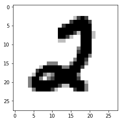

# 手写数字的识别

## 1.提出问题

根据整理好的mnist数据集，能够进行十种手写数字的识别。


```python
# 导包
import tensorflow as tf
from tensorflow.examples.tutorials.mnist import input_data
import numpy as np
import matplotlib.pyplot as plt
```

## 2.数据的收集


```python
# 读入数据集
mnist = input_data.read_data_sets("datasets/",one_hot=True)
print("mnist数据集下载完毕....")
```

    WARNING:tensorflow:From <ipython-input-3-e259b1bad7dd>:2: read_data_sets (from tensorflow.contrib.learn.python.learn.datasets.mnist) is deprecated and will be removed in a future version.
    Instructions for updating:
    Please use alternatives such as official/mnist/dataset.py from tensorflow/models.
    WARNING:tensorflow:From /Library/Frameworks/Python.framework/Versions/3.6/lib/python3.6/site-packages/tensorflow/contrib/learn/python/learn/datasets/mnist.py:260: maybe_download (from tensorflow.contrib.learn.python.learn.datasets.base) is deprecated and will be removed in a future version.
    Instructions for updating:
    Please write your own downloading logic.
    WARNING:tensorflow:From /Library/Frameworks/Python.framework/Versions/3.6/lib/python3.6/site-packages/tensorflow/contrib/learn/python/learn/datasets/base.py:252: _internal_retry.<locals>.wrap.<locals>.wrapped_fn (from tensorflow.contrib.learn.python.learn.datasets.base) is deprecated and will be removed in a future version.
    Instructions for updating:
    Please use urllib or similar directly.


    ---------------------------------------------------------------------------

    SSLError                                  Traceback (most recent call last)

    /Library/Frameworks/Python.framework/Versions/3.6/lib/python3.6/urllib/request.py in do_open(self, http_class, req, **http_conn_args)
       1317                 h.request(req.get_method(), req.selector, req.data, headers,
    -> 1318                           encode_chunked=req.has_header('Transfer-encoding'))
       1319             except OSError as err: # timeout error


    /Library/Frameworks/Python.framework/Versions/3.6/lib/python3.6/http/client.py in request(self, method, url, body, headers, encode_chunked)
       1238         """Send a complete request to the server."""
    -> 1239         self._send_request(method, url, body, headers, encode_chunked)
       1240 


    /Library/Frameworks/Python.framework/Versions/3.6/lib/python3.6/http/client.py in _send_request(self, method, url, body, headers, encode_chunked)
       1284             body = _encode(body, 'body')
    -> 1285         self.endheaders(body, encode_chunked=encode_chunked)
       1286 


    /Library/Frameworks/Python.framework/Versions/3.6/lib/python3.6/http/client.py in endheaders(self, message_body, encode_chunked)
       1233             raise CannotSendHeader()
    -> 1234         self._send_output(message_body, encode_chunked=encode_chunked)
       1235 


    /Library/Frameworks/Python.framework/Versions/3.6/lib/python3.6/http/client.py in _send_output(self, message_body, encode_chunked)
       1025         del self._buffer[:]
    -> 1026         self.send(msg)
       1027 


    /Library/Frameworks/Python.framework/Versions/3.6/lib/python3.6/http/client.py in send(self, data)
        963             if self.auto_open:
    --> 964                 self.connect()
        965             else:


    /Library/Frameworks/Python.framework/Versions/3.6/lib/python3.6/http/client.py in connect(self)
       1399             self.sock = self._context.wrap_socket(self.sock,
    -> 1400                                                   server_hostname=server_hostname)
       1401             if not self._context.check_hostname and self._check_hostname:


    /Library/Frameworks/Python.framework/Versions/3.6/lib/python3.6/ssl.py in wrap_socket(self, sock, server_side, do_handshake_on_connect, suppress_ragged_eofs, server_hostname, session)
        406                          server_hostname=server_hostname,
    --> 407                          _context=self, _session=session)
        408 


    /Library/Frameworks/Python.framework/Versions/3.6/lib/python3.6/ssl.py in __init__(self, sock, keyfile, certfile, server_side, cert_reqs, ssl_version, ca_certs, do_handshake_on_connect, family, type, proto, fileno, suppress_ragged_eofs, npn_protocols, ciphers, server_hostname, _context, _session)
        813                         raise ValueError("do_handshake_on_connect should not be specified for non-blocking sockets")
    --> 814                     self.do_handshake()
        815 


    /Library/Frameworks/Python.framework/Versions/3.6/lib/python3.6/ssl.py in do_handshake(self, block)
       1067                 self.settimeout(None)
    -> 1068             self._sslobj.do_handshake()
       1069         finally:


    /Library/Frameworks/Python.framework/Versions/3.6/lib/python3.6/ssl.py in do_handshake(self)
        688         """Start the SSL/TLS handshake."""
    --> 689         self._sslobj.do_handshake()
        690         if self.context.check_hostname:


    SSLError: [SSL: CERTIFICATE_VERIFY_FAILED] certificate verify failed (_ssl.c:777)

    
    During handling of the above exception, another exception occurred:


    URLError                                  Traceback (most recent call last)

    <ipython-input-3-e259b1bad7dd> in <module>()
          1 # 读入数据集
    ----> 2 mnist = input_data.read_data_sets("datasets/",one_hot=True)
          3 print("mnist数据集下载完毕....")


    /Library/Frameworks/Python.framework/Versions/3.6/lib/python3.6/site-packages/tensorflow/python/util/deprecation.py in new_func(*args, **kwargs)
        304               'in a future version' if date is None else ('after %s' % date),
        305               instructions)
    --> 306       return func(*args, **kwargs)
        307     return tf_decorator.make_decorator(
        308         func, new_func, 'deprecated',


    /Library/Frameworks/Python.framework/Versions/3.6/lib/python3.6/site-packages/tensorflow/contrib/learn/python/learn/datasets/mnist.py in read_data_sets(train_dir, fake_data, one_hot, dtype, reshape, validation_size, seed, source_url)
        258 
        259   local_file = base.maybe_download(TRAIN_IMAGES, train_dir,
    --> 260                                    source_url + TRAIN_IMAGES)
        261   with gfile.Open(local_file, 'rb') as f:
        262     train_images = extract_images(f)


    /Library/Frameworks/Python.framework/Versions/3.6/lib/python3.6/site-packages/tensorflow/python/util/deprecation.py in new_func(*args, **kwargs)
        304               'in a future version' if date is None else ('after %s' % date),
        305               instructions)
    --> 306       return func(*args, **kwargs)
        307     return tf_decorator.make_decorator(
        308         func, new_func, 'deprecated',


    /Library/Frameworks/Python.framework/Versions/3.6/lib/python3.6/site-packages/tensorflow/contrib/learn/python/learn/datasets/base.py in maybe_download(filename, work_directory, source_url)
        250   filepath = os.path.join(work_directory, filename)
        251   if not gfile.Exists(filepath):
    --> 252     temp_file_name, _ = urlretrieve_with_retry(source_url)
        253     gfile.Copy(temp_file_name, filepath)
        254     with gfile.GFile(filepath) as f:


    /Library/Frameworks/Python.framework/Versions/3.6/lib/python3.6/site-packages/tensorflow/python/util/deprecation.py in new_func(*args, **kwargs)
        304               'in a future version' if date is None else ('after %s' % date),
        305               instructions)
    --> 306       return func(*args, **kwargs)
        307     return tf_decorator.make_decorator(
        308         func, new_func, 'deprecated',


    /Library/Frameworks/Python.framework/Versions/3.6/lib/python3.6/site-packages/tensorflow/contrib/learn/python/learn/datasets/base.py in wrapped_fn(*args, **kwargs)
        203       for delay in delays():
        204         try:
    --> 205           return fn(*args, **kwargs)
        206         except Exception as e:  # pylint: disable=broad-except
        207           if is_retriable is None:


    /Library/Frameworks/Python.framework/Versions/3.6/lib/python3.6/site-packages/tensorflow/contrib/learn/python/learn/datasets/base.py in urlretrieve_with_retry(url, filename)
        231 @_internal_retry(initial_delay=1.0, max_delay=16.0, is_retriable=_is_retriable)
        232 def urlretrieve_with_retry(url, filename=None):
    --> 233   return urllib.request.urlretrieve(url, filename)
        234 
        235 


    /Library/Frameworks/Python.framework/Versions/3.6/lib/python3.6/urllib/request.py in urlretrieve(url, filename, reporthook, data)
        246     url_type, path = splittype(url)
        247 
    --> 248     with contextlib.closing(urlopen(url, data)) as fp:
        249         headers = fp.info()
        250 


    /Library/Frameworks/Python.framework/Versions/3.6/lib/python3.6/urllib/request.py in urlopen(url, data, timeout, cafile, capath, cadefault, context)
        221     else:
        222         opener = _opener
    --> 223     return opener.open(url, data, timeout)
        224 
        225 def install_opener(opener):


    /Library/Frameworks/Python.framework/Versions/3.6/lib/python3.6/urllib/request.py in open(self, fullurl, data, timeout)
        524             req = meth(req)
        525 
    --> 526         response = self._open(req, data)
        527 
        528         # post-process response


    /Library/Frameworks/Python.framework/Versions/3.6/lib/python3.6/urllib/request.py in _open(self, req, data)
        542         protocol = req.type
        543         result = self._call_chain(self.handle_open, protocol, protocol +
    --> 544                                   '_open', req)
        545         if result:
        546             return result


    /Library/Frameworks/Python.framework/Versions/3.6/lib/python3.6/urllib/request.py in _call_chain(self, chain, kind, meth_name, *args)
        502         for handler in handlers:
        503             func = getattr(handler, meth_name)
    --> 504             result = func(*args)
        505             if result is not None:
        506                 return result


    /Library/Frameworks/Python.framework/Versions/3.6/lib/python3.6/urllib/request.py in https_open(self, req)
       1359         def https_open(self, req):
       1360             return self.do_open(http.client.HTTPSConnection, req,
    -> 1361                 context=self._context, check_hostname=self._check_hostname)
       1362 
       1363         https_request = AbstractHTTPHandler.do_request_


    /Library/Frameworks/Python.framework/Versions/3.6/lib/python3.6/urllib/request.py in do_open(self, http_class, req, **http_conn_args)
       1318                           encode_chunked=req.has_header('Transfer-encoding'))
       1319             except OSError as err: # timeout error
    -> 1320                 raise URLError(err)
       1321             r = h.getresponse()
       1322         except:


    URLError: <urlopen error [SSL: CERTIFICATE_VERIFY_FAILED] certificate verify failed (_ssl.c:777)>


## 3.数据的探索


```python
idx = 1046
img = mnist.test.images[idx]
print("数据类型：", type(img))
print("数组元素的数据类型",img.dtype)
print("数组元素的总数",img.size)
print("数组元素的形状",img.shape)
print("数组元素的维度",img.ndim)
```

    数据类型： <class 'numpy.ndarray'>
    数组元素的数据类型 float32
    数组元素的总数 784
    数组元素的形状 (784,)
    数组元素的维度 1


```python
count = 0
for i in img:
    print("%4d" %(int(i*255)),end=" ")
    count += 1
    if(count % 28 == 0):
        print(end="\n")
```

       0    0    0    0    0    0    0    0    0    0    0    0    0    0    0    0    0    0    0    0    0    0    0    0    0    0    0    0 
       0    0    0    0    0    0    0    0    0    0    0    0    0    0    0    0    0    0    0    0    0    0    0    0    0    0    0    0 
       0    0    0    0    0    0    0    0    0    0    0    0    0    0    0    0    0    0    0    0    0    0    0    0    0    0    0    0 
       0    0    0    0    0    0    0    0    0    0    0    0    0    0    0    0    0    0    0    0    0    0    0    0    0    0    0    0 
       0    0    0    0    0    0    0    0    0    0    0    0    0    0    0    0    0    0    0    0    0    0    0    0    0    0    0    0 
       0    0    0    0    0    0    0    0    0    0  131   55    0    0    0   43   43   43   69  148   62    0    0    0    0    0    0    0 
       0    0    0    0    0    0    0    0    0    0  148  168    0   22  173  253  252  252  231  124   27    0    0    0    0    0    0    0 
       0    0    0    0    0    0    0    0    0    0  201  246  144  237  252  241  196   73   16    0    0    0    0    0    0    0    0    0 
       0    0    0    0    0    0    0    0    0    0  253  252  252  236  101   35    0    0    0    0    0    0    0    0    0    0    0    0 
       0    0    0    0    0    0    0    0    0   89  253  252  146   31    0    0    0    0    0    0    0    0    0    0    0    0    0    0 
       0    0    0    0    0    0    0    0    0  107  255  183    4    0    0    0    0    0    0    0    0    0    0    0    0    0    0    0 
       0    0    0    0    0    0    0    0    0   27  253  252  135    0    0    0    0    0    0    0    0    0    0    0    0    0    0    0 
       0    0    0    0    0    0    0    0    0    0  144  247  251  206   83    9    0    0    0    0    0    0    0    0    0    0    0    0 
       0    0    0    0    0    0    0    0    0    0    0   99  194  252  252  204   69    0    0    0    0    0    0    0    0    0    0    0 
       0    0    0    0    0    0    0    0    0    0    0    0    4  113  235  253  239   62    0    0    0    0    0    0    0    0    0    0 
       0    0    0    0    0    0    0    0    0    0    0    0    0    0   45  193  253  232    0    0    0    0    0    0    0    0    0    0 
       0    0    0    0    0    0    0    0    0    0    0    0    0    0    0   37  205  247   63    0    0    0    0    0    0    0    0    0 
       0    0    0    0    0    0    0    0    0    0    0    0    0    0    0    0   94  252  180    0    0    0    0    0    0    0    0    0 
       0    0    0    0    0    0    0    0    0    0    0    0    0    0    0    0   85  252  189    0    0    0    0    0    0    0    0    0 
       0    0    0    0    0    0    0    0    0    0    0    0    0    0    0    0  128  252  189    0    0    0    0    0    0    0    0    0 
       0    0    0    0    0    0    0    0    0    0    0    0    0    0    0   43  227  250   70    0    0    0    0    0    0    0    0    0 
       0    0    0    0    0    0    0    0    0    0    0    0    0    0   36  227  252  196    0    0    0    0    0    0    0    0    0    0 
       0    0    0    0    0    0    0    0    0  107   18    8   31  127  223  253  245   72    0    0    0    0    0    0    0    0    0    0 
       0    0    0    0    0    0    0    0    0  185  239  197  252  252  252  199   56    0    0    0    0    0    0    0    0    0    0    0 
       0    0    0    0    0    0    0    0    0   18  209  252  252  182  103   18    0    0    0    0    0    0    0    0    0    0    0    0 
       0    0    0    0    0    0    0    0    0    0    0    0    0    0    0    0    0    0    0    0    0    0    0    0    0    0    0    0 
       0    0    0    0    0    0    0    0    0    0    0    0    0    0    0    0    0    0    0    0    0    0    0    0    0    0    0    0 
       0    0    0    0    0    0    0    0    0    0    0    0    0    0    0    0    0    0    0    0    0    0    0    0    0    0    0    0 


```python
label = mnist.test.labels[idx]
print(label)
```

    [0. 0. 0. 0. 0. 1. 0. 0. 0. 0.]


```python
plt.title(label)
img = img.reshape(28,28)
plt.imshow(img,cmap=plt.get_cmap('gray_r'))
```


    <matplotlib.image.AxesImage at 0x1fdf9240>


## 4.数据预处理


```python
## 分割训练集和测试集
X = mnist.train.images
Y = mnist.train.labels
print("训练集特征的形状：" + str(X.shape))
print("训练集标签的形状：" + str(Y.shape))

X_test =  mnist.test.images
Y_test =  mnist.test.labels
```

## 3.搭建模型


```python
model = tf.keras.Sequential()
model.add(tf.keras.layers.Dense(units=10, input_dim=784))
# 添加激活层
model.add(tf.keras.layers.Activation('softmax'))
model.summary()  # 查看模型结构
```

    _________________________________________________________________
    Layer (type)                 Output Shape              Param #   
    =================================================================
    dense_2 (Dense)              (None, 10)                7850      
    _________________________________________________________________
    activation_2 (Activation)    (None, 10)                0         
    =================================================================
    Total params: 7,850
    Trainable params: 7,850
    Non-trainable params: 0
    _________________________________________________________________


```python
model.compile(loss='categorical_crossentropy', optimizer='sgd',metrics=['accuracy'])
```


```python
model.fit(X,Y,epochs=100,batch_size=100)
```

    Epoch 1/100
    55000/55000 [==============================] - 1s 13us/step - loss: 1.1849 - acc: 0.7279
    Epoch 2/100
    55000/55000 [==============================] - 1s 10us/step - loss: 0.6705 - acc: 0.8466
    Epoch 3/100
    55000/55000 [==============================] - 1s 10us/step - loss: 0.5570 - acc: 0.8641
    Epoch 4/100
    55000/55000 [==============================] - 1s 10us/step - loss: 0.5022 - acc: 0.8723
    Epoch 5/100
    55000/55000 [==============================] - 1s 10us/step - loss: 0.4686 - acc: 0.8786
    Epoch 6/100
    55000/55000 [==============================] - 1s 10us/step - loss: 0.4453 - acc: 0.8827
    Epoch 7/100
    55000/55000 [==============================] - 1s 10us/step - loss: 0.4280 - acc: 0.8861
    Epoch 8/100
    55000/55000 [==============================] - 1s 10us/step - loss: 0.4145 - acc: 0.8893
    Epoch 9/100
    55000/55000 [==============================] - 1s 10us/step - loss: 0.4035 - acc: 0.8915
    Epoch 10/100
    55000/55000 [==============================] - 1s 10us/step - loss: 0.3944 - acc: 0.8931
    Epoch 11/100
    55000/55000 [==============================] - 1s 10us/step - loss: 0.3866 - acc: 0.8950
    Epoch 12/100
    55000/55000 [==============================] - 1s 10us/step - loss: 0.3799 - acc: 0.8964
    Epoch 13/100
    55000/55000 [==============================] - 1s 10us/step - loss: 0.3741 - acc: 0.8974
    Epoch 14/100
    55000/55000 [==============================] - 1s 10us/step - loss: 0.3688 - acc: 0.8988
    Epoch 15/100
    55000/55000 [==============================] - 1s 10us/step - loss: 0.3642 - acc: 0.9001
    Epoch 16/100
    55000/55000 [==============================] - 1s 10us/step - loss: 0.3601 - acc: 0.9008
    Epoch 17/100
    55000/55000 [==============================] - 1s 10us/step - loss: 0.3562 - acc: 0.9021
    Epoch 18/100
    55000/55000 [==============================] - 1s 10us/step - loss: 0.3528 - acc: 0.9025
    Epoch 19/100
    55000/55000 [==============================] - 1s 10us/step - loss: 0.3496 - acc: 0.9033
    Epoch 20/100
    55000/55000 [==============================] - 1s 10us/step - loss: 0.3466 - acc: 0.9037
    Epoch 21/100
    55000/55000 [==============================] - 1s 10us/step - loss: 0.3439 - acc: 0.9047
    Epoch 22/100
    55000/55000 [==============================] - 1s 10us/step - loss: 0.3414 - acc: 0.9050
    Epoch 23/100
    55000/55000 [==============================] - 1s 10us/step - loss: 0.3390 - acc: 0.9060
    Epoch 24/100
    55000/55000 [==============================] - 1s 10us/step - loss: 0.3368 - acc: 0.9064
    Epoch 25/100
    55000/55000 [==============================] - 1s 10us/step - loss: 0.3347 - acc: 0.9069
    Epoch 26/100
    55000/55000 [==============================] - 1s 10us/step - loss: 0.3328 - acc: 0.9074
    Epoch 27/100
    55000/55000 [==============================] - 1s 10us/step - loss: 0.3309 - acc: 0.9077
    Epoch 28/100
    55000/55000 [==============================] - 1s 10us/step - loss: 0.3292 - acc: 0.9083
    Epoch 29/100
    55000/55000 [==============================] - 1s 10us/step - loss: 0.3275 - acc: 0.9085
    Epoch 30/100
    55000/55000 [==============================] - 1s 10us/step - loss: 0.3259 - acc: 0.9092
    Epoch 31/100
    55000/55000 [==============================] - 1s 10us/step - loss: 0.3244 - acc: 0.9095
    Epoch 32/100
    55000/55000 [==============================] - 1s 10us/step - loss: 0.3230 - acc: 0.9098
    Epoch 33/100
    55000/55000 [==============================] - 1s 10us/step - loss: 0.3216 - acc: 0.9102
    Epoch 34/100
    55000/55000 [==============================] - 1s 10us/step - loss: 0.3204 - acc: 0.9106
    Epoch 35/100
    55000/55000 [==============================] - 1s 10us/step - loss: 0.3191 - acc: 0.9112
    Epoch 36/100
    55000/55000 [==============================] - 1s 10us/step - loss: 0.3179 - acc: 0.9117
    Epoch 37/100
    55000/55000 [==============================] - 1s 10us/step - loss: 0.3167 - acc: 0.9119
    Epoch 38/100
    55000/55000 [==============================] - 1s 10us/step - loss: 0.3157 - acc: 0.9125
    Epoch 39/100
    55000/55000 [==============================] - 1s 10us/step - loss: 0.3146 - acc: 0.9129
    Epoch 40/100
    55000/55000 [==============================] - 1s 10us/step - loss: 0.3136 - acc: 0.9132
    Epoch 41/100
    55000/55000 [==============================] - 1s 10us/step - loss: 0.3126 - acc: 0.9132
    Epoch 42/100
    55000/55000 [==============================] - 1s 10us/step - loss: 0.3116 - acc: 0.9137
    Epoch 43/100
    55000/55000 [==============================] - 1s 10us/step - loss: 0.3107 - acc: 0.9139
    Epoch 44/100
    55000/55000 [==============================] - 1s 10us/step - loss: 0.3098 - acc: 0.9142
    Epoch 45/100
    55000/55000 [==============================] - 1s 10us/step - loss: 0.3089 - acc: 0.9141
    Epoch 46/100
    55000/55000 [==============================] - 1s 10us/step - loss: 0.3081 - acc: 0.9148
    Epoch 47/100
    55000/55000 [==============================] - 1s 14us/step - loss: 0.3073 - acc: 0.9150
    Epoch 48/100
    55000/55000 [==============================] - 1s 14us/step - loss: 0.3066 - acc: 0.9149
    Epoch 49/100
    55000/55000 [==============================] - 1s 12us/step - loss: 0.3058 - acc: 0.9151
    Epoch 50/100
    55000/55000 [==============================] - 1s 11us/step - loss: 0.3051 - acc: 0.9154
    Epoch 51/100
    55000/55000 [==============================] - 1s 11us/step - loss: 0.3044 - acc: 0.9157
    Epoch 52/100
    55000/55000 [==============================] - 1s 11us/step - loss: 0.3037 - acc: 0.9155
    Epoch 53/100
    55000/55000 [==============================] - 1s 10us/step - loss: 0.3030 - acc: 0.9158
    Epoch 54/100
    55000/55000 [==============================] - 1s 10us/step - loss: 0.3023 - acc: 0.9162
    Epoch 55/100
    55000/55000 [==============================] - 1s 10us/step - loss: 0.3017 - acc: 0.9161
    Epoch 56/100
    55000/55000 [==============================] - 1s 10us/step - loss: 0.3011 - acc: 0.9167
    Epoch 57/100
    55000/55000 [==============================] - 1s 10us/step - loss: 0.3004 - acc: 0.9166
    Epoch 58/100
    55000/55000 [==============================] - 1s 10us/step - loss: 0.2999 - acc: 0.9166
    Epoch 59/100
    55000/55000 [==============================] - 1s 10us/step - loss: 0.2993 - acc: 0.9170
    Epoch 60/100
    55000/55000 [==============================] - 1s 10us/step - loss: 0.2987 - acc: 0.9173
    Epoch 61/100
    55000/55000 [==============================] - 1s 10us/step - loss: 0.2981 - acc: 0.9170
    Epoch 62/100
    55000/55000 [==============================] - 1s 10us/step - loss: 0.2977 - acc: 0.9174
    Epoch 63/100
    55000/55000 [==============================] - 1s 10us/step - loss: 0.2971 - acc: 0.9174
    Epoch 64/100
    55000/55000 [==============================] - 1s 10us/step - loss: 0.2966 - acc: 0.9177
    Epoch 65/100
    55000/55000 [==============================] - 1s 10us/step - loss: 0.2961 - acc: 0.9174
    Epoch 66/100
    55000/55000 [==============================] - 1s 10us/step - loss: 0.2956 - acc: 0.9177
    Epoch 67/100
    55000/55000 [==============================] - 1s 10us/step - loss: 0.2952 - acc: 0.9180
    Epoch 68/100
    55000/55000 [==============================] - 1s 10us/step - loss: 0.2947 - acc: 0.9179
    Epoch 69/100
    55000/55000 [==============================] - 1s 10us/step - loss: 0.2942 - acc: 0.9183
    Epoch 70/100
    55000/55000 [==============================] - 1s 10us/step - loss: 0.2938 - acc: 0.9180
    Epoch 71/100
    55000/55000 [==============================] - 1s 10us/step - loss: 0.2933 - acc: 0.9184
    Epoch 72/100
    55000/55000 [==============================] - 1s 10us/step - loss: 0.2929 - acc: 0.9183
    Epoch 73/100
    55000/55000 [==============================] - 1s 10us/step - loss: 0.2924 - acc: 0.9186
    Epoch 74/100
    55000/55000 [==============================] - 1s 10us/step - loss: 0.2921 - acc: 0.9185
    Epoch 75/100
    55000/55000 [==============================] - 1s 10us/step - loss: 0.2917 - acc: 0.9188
    Epoch 76/100
    55000/55000 [==============================] - 1s 10us/step - loss: 0.2913 - acc: 0.9187
    Epoch 77/100
    55000/55000 [==============================] - 1s 10us/step - loss: 0.2909 - acc: 0.9191
    Epoch 78/100
    55000/55000 [==============================] - 1s 10us/step - loss: 0.2905 - acc: 0.9193
    Epoch 79/100
    55000/55000 [==============================] - 1s 10us/step - loss: 0.2901 - acc: 0.9193
    Epoch 80/100
    55000/55000 [==============================] - 1s 10us/step - loss: 0.2897 - acc: 0.9193
    Epoch 81/100
    55000/55000 [==============================] - 1s 10us/step - loss: 0.2894 - acc: 0.9191
    Epoch 82/100
    55000/55000 [==============================] - 1s 10us/step - loss: 0.2890 - acc: 0.9193
    Epoch 83/100
    55000/55000 [==============================] - 1s 10us/step - loss: 0.2887 - acc: 0.9193
    Epoch 84/100
    55000/55000 [==============================] - 1s 10us/step - loss: 0.2884 - acc: 0.9194
    Epoch 85/100
    55000/55000 [==============================] - 1s 10us/step - loss: 0.2879 - acc: 0.9196
    Epoch 86/100
    55000/55000 [==============================] - 1s 10us/step - loss: 0.2877 - acc: 0.9199
    Epoch 87/100
    55000/55000 [==============================] - 1s 10us/step - loss: 0.2873 - acc: 0.9200
    Epoch 88/100
    55000/55000 [==============================] - 1s 10us/step - loss: 0.2870 - acc: 0.9199
    Epoch 89/100
    55000/55000 [==============================] - 1s 10us/step - loss: 0.2867 - acc: 0.9201
    Epoch 90/100
    55000/55000 [==============================] - 1s 10us/step - loss: 0.2864 - acc: 0.9201
    Epoch 91/100
    55000/55000 [==============================] - 1s 10us/step - loss: 0.2861 - acc: 0.9201
    Epoch 92/100
    55000/55000 [==============================] - 1s 10us/step - loss: 0.2858 - acc: 0.9202
    Epoch 93/100
    55000/55000 [==============================] - 1s 10us/step - loss: 0.2855 - acc: 0.9204
    Epoch 94/100
    55000/55000 [==============================] - 1s 10us/step - loss: 0.2852 - acc: 0.9206
    Epoch 95/100
    55000/55000 [==============================] - 1s 10us/step - loss: 0.2849 - acc: 0.9207
    Epoch 96/100
    55000/55000 [==============================] - 1s 10us/step - loss: 0.2846 - acc: 0.9205
    Epoch 97/100
    55000/55000 [==============================] - 1s 10us/step - loss: 0.2843 - acc: 0.9207
    Epoch 98/100
    55000/55000 [==============================] - 1s 10us/step - loss: 0.2841 - acc: 0.9208
    Epoch 99/100
    55000/55000 [==============================] - 1s 10us/step - loss: 0.2838 - acc: 0.9209
    Epoch 100/100
    55000/55000 [==============================] - 1s 10us/step - loss: 0.2835 - acc: 0.9209


    <tensorflow.python.keras.callbacks.History at 0x11962c50>


## 4.评估模型


```python
loss,acc = model.evaluate(X_test,Y_test)
print(acc)
```

    10000/10000 [==============================] - 0s 17us/step
    0.9209


## 5.模型的使用


```python
idx = np.random.randint(10000)
img = mnist.test.images[idx]
img = img.reshape(28,28)
plt.imshow(img,cmap=plt.get_cmap('gray_r'))
```


    <matplotlib.image.AxesImage at 0x23c3cdd8>





```python
img = img.reshape(1,784)
print("=====预测值=====")
print(model.predict(img).argmax())
label = mnist.test.labels[idx]
print("=====真实值=====")
print(label.argmax())
```

    =====预测值=====
    2
    =====真实值=====
    2


## 6.模型的保存


```python
model.save("model_mnist_linear.h5")
del model
```
