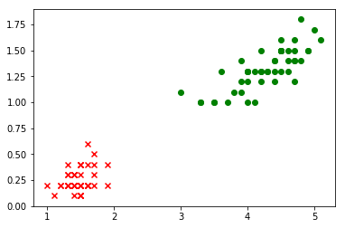
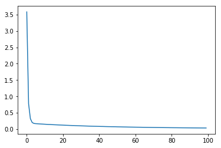
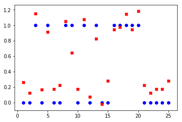

# 鸢尾花的二分类_v0.1


```python
## 导包
import pandas as pd
import matplotlib.pyplot as plt
import numpy as np
import tensorflow as tf

from tensorflow.keras import layers
from sklearn.model_selection import train_test_split
```

## 1. 提出问题

根据处理好的数据集iris_bi.data.csv,进行两种鸢尾花setosa和versicolor的分类。

## 2.导入新的数据集


```python
datasets_path = 'data/iris_bi.data.csv'
iris = pd.read_csv(datasets_path,header=None)
print(iris.sample(5))
```

          0    1  2
    35  1.2  0.2  0
    60  3.5  1.0  1
    71  4.0  1.3  1
    16  1.3  0.4  0
    56  4.7  1.6  1


```python
# 转换为np.array
iris = np.array(iris)
print(type(iris))
print(iris.shape)
```

    <class 'numpy.ndarray'>
    (100, 3)


```python
# 可视化
plt.scatter(iris[:49,0],iris[:49,1],marker='x',c='red')
plt.scatter(iris[50:99,0],iris[50:99,1],marker='o',c='green')
```


    <matplotlib.collections.PathCollection at 0x1343839b0>





```python
# 拆分特征和标签
iris_X = iris[:,0:2]
iris_y = iris[:,-1]
print("特征集的形状：" + str(iris_X.shape))
print("标签集的形状：" + str(iris_y.shape))
```

    特征集的形状：(100, 2)
    标签集的形状：(100,)


```python
# 拆分训练集和测试集
X_train,X_test,y_train,y_test = train_test_split(iris_X,iris_y,test_size=0.25)
print("训练特征集的形状：" + str(X_train.shape))
print("训练标签集的形状：" + str(y_train.shape))
print("测试特征集的形状：" + str(X_test.shape))
print("测试标签集的形状：" + str(y_test.shape))
```

    训练特征集的形状：(75, 2)
    训练标签集的形状：(75,)
    测试特征集的形状：(25, 2)
    测试标签集的形状：(25,)


## 2.训练模型


```python
# 搭建模型
model = tf.keras.Sequential()
model.add(tf.keras.layers.Dense(units=1, input_dim=2))
model.summary()  # 查看模型结构
```

    _________________________________________________________________
    Layer (type)                 Output Shape              Param #   
    =================================================================
    dense_1 (Dense)              (None, 1)                 3         
    =================================================================
    Total params: 3
    Trainable params: 3
    Non-trainable params: 0
    _________________________________________________________________


```python
# 编译模型
model.compile(optimizer='sgd', loss='mse')
```


```python
# 训练模型
history = model.fit(X_train, y_train,epochs=100)
```

    Epoch 1/100
    75/75 [==============================] - 0s 2ms/step - loss: 3.5816
    Epoch 2/100
    75/75 [==============================] - 0s 126us/step - loss: 0.7773
    Epoch 3/100
    75/75 [==============================] - 0s 243us/step - loss: 0.3197
    Epoch 4/100
    75/75 [==============================] - 0s 238us/step - loss: 0.2034
    Epoch 5/100
    75/75 [==============================] - 0s 294us/step - loss: 0.1746
    Epoch 6/100
    75/75 [==============================] - 0s 176us/step - loss: 0.1686
    Epoch 7/100
    75/75 [==============================] - 0s 212us/step - loss: 0.1647
    Epoch 8/100
    75/75 [==============================] - 0s 206us/step - loss: 0.1609
    Epoch 9/100
    75/75 [==============================] - 0s 241us/step - loss: 0.1572
    Epoch 10/100
    75/75 [==============================] - 0s 170us/step - loss: 0.1543
    Epoch 11/100
    75/75 [==============================] - 0s 287us/step - loss: 0.1508
    Epoch 12/100
    75/75 [==============================] - 0s 358us/step - loss: 0.1474
    Epoch 13/100
    75/75 [==============================] - 0s 220us/step - loss: 0.1446
    Epoch 14/100
    75/75 [==============================] - 0s 201us/step - loss: 0.1428
    Epoch 15/100
    75/75 [==============================] - 0s 127us/step - loss: 0.1386
    Epoch 16/100
    75/75 [==============================] - 0s 125us/step - loss: 0.1359
    Epoch 17/100
    75/75 [==============================] - 0s 137us/step - loss: 0.1334
    Epoch 18/100
    75/75 [==============================] - 0s 105us/step - loss: 0.1309
    Epoch 19/100
    75/75 [==============================] - 0s 90us/step - loss: 0.1284
    Epoch 20/100
    75/75 [==============================] - 0s 131us/step - loss: 0.1264
    Epoch 21/100
    75/75 [==============================] - 0s 142us/step - loss: 0.1236
    Epoch 22/100
    75/75 [==============================] - 0s 163us/step - loss: 0.1208
    Epoch 23/100
    75/75 [==============================] - 0s 103us/step - loss: 0.1184
    Epoch 24/100
    75/75 [==============================] - 0s 193us/step - loss: 0.1164
    Epoch 25/100
    75/75 [==============================] - 0s 136us/step - loss: 0.1138
    Epoch 26/100
    75/75 [==============================] - 0s 181us/step - loss: 0.1119
    Epoch 27/100
    75/75 [==============================] - 0s 151us/step - loss: 0.1109
    Epoch 28/100
    75/75 [==============================] - 0s 112us/step - loss: 0.1079
    Epoch 29/100
    75/75 [==============================] - 0s 117us/step - loss: 0.1060
    Epoch 30/100
    75/75 [==============================] - 0s 81us/step - loss: 0.1037
    Epoch 31/100
    75/75 [==============================] - 0s 223us/step - loss: 0.1015
    Epoch 32/100
    75/75 [==============================] - 0s 109us/step - loss: 0.0999
    Epoch 33/100
    75/75 [==============================] - 0s 96us/step - loss: 0.0980
    Epoch 34/100
    75/75 [==============================] - 0s 158us/step - loss: 0.0961
    Epoch 35/100
    75/75 [==============================] - 0s 155us/step - loss: 0.0942
    Epoch 36/100
    75/75 [==============================] - 0s 102us/step - loss: 0.0927
    Epoch 37/100
    75/75 [==============================] - 0s 144us/step - loss: 0.0909
    Epoch 38/100
    75/75 [==============================] - 0s 96us/step - loss: 0.0893
    Epoch 39/100
    75/75 [==============================] - 0s 131us/step - loss: 0.0882
    Epoch 40/100
    75/75 [==============================] - 0s 120us/step - loss: 0.0866
    Epoch 41/100
    75/75 [==============================] - 0s 156us/step - loss: 0.0849
    Epoch 42/100
    75/75 [==============================] - 0s 95us/step - loss: 0.0834
    Epoch 43/100
    75/75 [==============================] - 0s 146us/step - loss: 0.0824
    Epoch 44/100
    75/75 [==============================] - 0s 172us/step - loss: 0.0807
    Epoch 45/100
    75/75 [==============================] - 0s 78us/step - loss: 0.0792
    Epoch 46/100
    75/75 [==============================] - 0s 118us/step - loss: 0.0777
    Epoch 47/100
    75/75 [==============================] - 0s 166us/step - loss: 0.0769
    Epoch 48/100
    75/75 [==============================] - 0s 115us/step - loss: 0.0757
    Epoch 49/100
    75/75 [==============================] - 0s 177us/step - loss: 0.0753
    Epoch 50/100
    75/75 [==============================] - 0s 138us/step - loss: 0.0744
    Epoch 51/100
    75/75 [==============================] - 0s 183us/step - loss: 0.0721
    Epoch 52/100
    75/75 [==============================] - 0s 132us/step - loss: 0.0710
    Epoch 53/100
    75/75 [==============================] - 0s 110us/step - loss: 0.0699
    Epoch 54/100
    75/75 [==============================] - 0s 177us/step - loss: 0.0682
    Epoch 55/100
    75/75 [==============================] - 0s 165us/step - loss: 0.0672
    Epoch 56/100
    75/75 [==============================] - 0s 92us/step - loss: 0.0662
    Epoch 57/100
    75/75 [==============================] - 0s 190us/step - loss: 0.0647
    Epoch 58/100
    75/75 [==============================] - 0s 116us/step - loss: 0.0637
    Epoch 59/100
    75/75 [==============================] - 0s 128us/step - loss: 0.0630
    Epoch 60/100
    75/75 [==============================] - 0s 101us/step - loss: 0.0620
    Epoch 61/100
    75/75 [==============================] - 0s 100us/step - loss: 0.0610
    Epoch 62/100
    75/75 [==============================] - 0s 80us/step - loss: 0.0602
    Epoch 63/100
    75/75 [==============================] - 0s 98us/step - loss: 0.0594
    Epoch 64/100
    75/75 [==============================] - 0s 162us/step - loss: 0.0587
    Epoch 65/100
    75/75 [==============================] - 0s 118us/step - loss: 0.0574
    Epoch 66/100
    75/75 [==============================] - 0s 88us/step - loss: 0.0565
    Epoch 67/100
    75/75 [==============================] - 0s 135us/step - loss: 0.0557
    Epoch 68/100
    75/75 [==============================] - 0s 114us/step - loss: 0.0548
    Epoch 69/100
    75/75 [==============================] - 0s 108us/step - loss: 0.0540
    Epoch 70/100
    75/75 [==============================] - 0s 154us/step - loss: 0.0533
    Epoch 71/100
    75/75 [==============================] - 0s 116us/step - loss: 0.0525
    Epoch 72/100
    75/75 [==============================] - 0s 143us/step - loss: 0.0516
    Epoch 73/100
    75/75 [==============================] - 0s 130us/step - loss: 0.0508
    Epoch 74/100
    75/75 [==============================] - 0s 132us/step - loss: 0.0501
    Epoch 75/100
    75/75 [==============================] - 0s 240us/step - loss: 0.0493
    Epoch 76/100
    75/75 [==============================] - 0s 136us/step - loss: 0.0486
    Epoch 77/100
    75/75 [==============================] - 0s 92us/step - loss: 0.0480
    Epoch 78/100
    75/75 [==============================] - 0s 83us/step - loss: 0.0474
    Epoch 79/100
    75/75 [==============================] - 0s 109us/step - loss: 0.0469
    Epoch 80/100
    75/75 [==============================] - 0s 150us/step - loss: 0.0460
    Epoch 81/100
    75/75 [==============================] - 0s 88us/step - loss: 0.0455
    Epoch 82/100
    75/75 [==============================] - 0s 141us/step - loss: 0.0449
    Epoch 83/100
    75/75 [==============================] - 0s 126us/step - loss: 0.0446
    Epoch 84/100
    75/75 [==============================] - 0s 100us/step - loss: 0.0440
    Epoch 85/100
    75/75 [==============================] - 0s 93us/step - loss: 0.0432
    Epoch 86/100
    75/75 [==============================] - 0s 110us/step - loss: 0.0428
    Epoch 87/100
    75/75 [==============================] - 0s 127us/step - loss: 0.0420
    Epoch 88/100
    75/75 [==============================] - 0s 123us/step - loss: 0.0416
    Epoch 89/100
    75/75 [==============================] - 0s 72us/step - loss: 0.0413
    Epoch 90/100
    75/75 [==============================] - 0s 71us/step - loss: 0.0407
    Epoch 91/100
    75/75 [==============================] - 0s 116us/step - loss: 0.0402
    Epoch 92/100
    75/75 [==============================] - 0s 111us/step - loss: 0.0397
    Epoch 93/100
    75/75 [==============================] - 0s 90us/step - loss: 0.0393
    Epoch 94/100
    75/75 [==============================] - 0s 75us/step - loss: 0.0390
    Epoch 95/100
    75/75 [==============================] - 0s 150us/step - loss: 0.0385
    Epoch 96/100
    75/75 [==============================] - 0s 108us/step - loss: 0.0381
    Epoch 97/100
    75/75 [==============================] - 0s 53us/step - loss: 0.0376
    Epoch 98/100
    75/75 [==============================] - 0s 138us/step - loss: 0.0372
    Epoch 99/100
    75/75 [==============================] - 0s 120us/step - loss: 0.0370
    Epoch 100/100
    75/75 [==============================] - 0s 111us/step - loss: 0.0366


## 3.评估模型


```python
# 输出loss函数的变化
plt.plot(history.history['loss'])
```


    [<matplotlib.lines.Line2D at 0x134d9d6a0>]





```python
# 在测试集上loss函数的值
model.evaluate(X_test,y_test)
```

    25/25 [==============================] - 0s 3ms/step


    0.030918527394533157


## 4.使用模型


```python
# 在测试集上进行预测
print("=====真实结果=====")
print(y_test)
print("=====预测结果=====")
predict = model.predict(X_test.reshape(-1,2))
print(predict.reshape(1,-1))
```

    =====真实结果=====
    [0. 0. 1. 0. 1. 0. 0. 1. 1. 0. 1. 0. 1. 0. 0. 1. 1. 1. 1. 1. 0. 0. 0. 0.
     0.]
    =====预测结果=====
    [[ 0.26433852  0.12519976  1.1531546   0.16561392  0.9152911   0.17456213
       0.22392443  1.0544298   0.645962    0.17456213  1.0769477   0.07583749
       0.8255148  -0.02288714  0.28223488  0.9467571   0.9736016   1.1442063
       0.9467571   1.1846204   0.22392443  0.12519976  0.17456213  0.17456213
       0.28223488]]


```python
# 可视化预测结果
x=np.arange(1,26) 
#print(model.predict(X_test.reshape(25,2)))
plt.scatter(x,y_test,marker='o',c='blue')
plt.scatter(x,predict,marker='X',c='red')
```


    <matplotlib.collections.PathCollection at 0x1348b55f8>





```python
# 使用真实的样本进行预测
target = model.predict(np.array([[6.5,3.9]]))[0][0]
print(target)
```

    0.5345514

